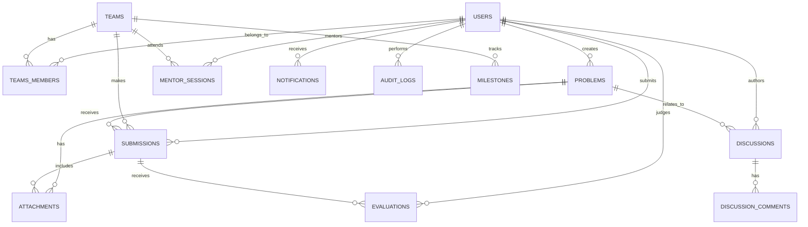

# HackYatra Database Design Document

## 1. Introduction
This document details the database architecture for **HackYatra**, a civic innovation platform connecting the Greater Visakhapatnam Municipal Corporation (GVMC) with students. Designed to support 100K+ concurrent users, the system uses **PostgreSQL** as the primary relational database and **Redis** for high-speed caching and session management.

## 2. Entity-Relationship Diagram
Below is the ER diagram representing the core entities and their relationships.



## 3. Table Definitions

All tables use `UUID` as primary keys for security and distribution, and include standard audit columns: `created_at`, `updated_at`, `deleted_at` (for soft deletes).

### 3.1 Users & Authentication

**`users`**
| Column | Type | Constraints | Description |
|--------|------|-------------|-------------|
| `id` | UUID | PRIMARY KEY, DEFAULT gen_random_uuid() | Unique identifier |
| `email` | VARCHAR(255) | UNIQUE, NOT NULL | User's email |
| `password_hash` | VARCHAR(255) | NOT NULL | Bcrypt/Argon2 hash |
| `full_name` | VARCHAR(150) | NOT NULL | Display name |
| `role` | VARCHAR(50) | NOT NULL | `student`, `mentor`, `official`, `admin` |
| `profile_data` | JSONB | | Extra attributes (bio, skills, org) |
| `is_verified` | BOOLEAN | DEFAULT FALSE | Email verification status |
| `created_at` | TIMESTAMPTZ | DEFAULT NOW() | |
| `updated_at` | TIMESTAMPTZ | DEFAULT NOW() | |

### 3.2 Teams & Organization

**`teams`**
| Column | Type | Constraints | Description |
|--------|------|-------------|-------------|
| `id` | UUID | PRIMARY KEY | |
| `name` | VARCHAR(150) | UNIQUE, NOT NULL | Team name |
| `lead_id` | UUID | FK(users.id), NOT NULL | Team Leader |
| `formation_date`| TIMESTAMPTZ | DEFAULT NOW() | |
| `status` | VARCHAR(50) | DEFAULT 'active' | `active`, `disbanded` |

**`team_members`**
| Column | Type | Constraints | Description |
|--------|------|-------------|-------------|
| `team_id` | UUID | FK(teams.id), NOT NULL | |
| `user_id` | UUID | FK(users.id), NOT NULL | |
| `role` | VARCHAR(50) | DEFAULT 'member' | `lead`, `member` |
| `joined_at` | TIMESTAMPTZ | DEFAULT NOW() | |

*Composite PK (team_id, user_id)*

### 3.3 Challenges & Problems

**`problems`**
| Column | Type | Constraints | Description |
|--------|------|-------------|-------------|
| `id` | UUID | PRIMARY KEY | |
| `title` | VARCHAR(255) | NOT NULL | Problem title |
| `description` | TEXT | NOT NULL | Detailed description |
| `category` | VARCHAR(100) | NOT NULL | e.g., Water, Traffic, Waste |
| `difficulty` | VARCHAR(50) | NOT NULL | `easy`, `medium`, `hard` |
| `ward_location` | VARCHAR(100) | | Specific GVMC ward |
| `status` | VARCHAR(50) | DEFAULT 'open' | `draft`, `open`, `closed` |
| `deadline` | TIMESTAMPTZ | NOT NULL | Submission deadline |
| `created_by` | UUID | FK(users.id), NOT NULL | Official who posted |
| `created_at` | TIMESTAMPTZ | DEFAULT NOW() | |

### 3.4 Submissions & Progress

**`submissions`**
| Column | Type | Constraints | Description |
|--------|------|-------------|-------------|
| `id` | UUID | PRIMARY KEY | |
| `team_id` | UUID | FK(teams.id), NOT NULL | |
| `problem_id` | UUID | FK(problems.id), NOT NULL | |
| `title` | VARCHAR(255) | NOT NULL | |
| `description` | TEXT | | |
| `repo_url` | VARCHAR(255) | | Source code link |
| `demo_url` | VARCHAR(255) | | Live demo link |
| `status` | VARCHAR(50) | DEFAULT 'draft' | `draft`, `submitted`, `evaluated` |
| `submitted_at`| TIMESTAMPTZ | | |

**`milestones`**
| Column | Type | Constraints | Description |
|--------|------|-------------|-------------|
| `id` | UUID | PRIMARY KEY | |
| `team_id` | UUID | FK(teams.id), NOT NULL | |
| `title` | VARCHAR(150) | NOT NULL | e.g., "Ideation Phase" |
| `description` | TEXT | | |
| `status` | VARCHAR(50) | DEFAULT 'pending' | `pending`, `completed` |
| `completed_at`| TIMESTAMPTZ | | |

### 3.5 Evaluation & Judging

**`evaluations`**
| Column | Type | Constraints | Description |
|--------|------|-------------|-------------|
| `id` | UUID | PRIMARY KEY | |
| `submission_id`| UUID | FK(submissions.id), NOT NULL| |
| `judge_id` | UUID | FK(users.id), NOT NULL | |
| `score` | NUMERIC(5,2)| NOT NULL | Total score |
| `rubric_data` | JSONB | NOT NULL | Breakdown of scores |
| `feedback` | TEXT | | Judge's comments |
| `created_at` | TIMESTAMPTZ | DEFAULT NOW() | |

### 3.6 Mentorship

**`mentor_assignments`**
| Column | Type | Constraints | Description |
|--------|------|-------------|-------------|
| `mentor_id` | UUID | FK(users.id), NOT NULL | |
| `team_id` | UUID | FK(teams.id), NOT NULL | |
| `assigned_at` | TIMESTAMPTZ | DEFAULT NOW() | |

**`mentor_sessions`**
| Column | Type | Constraints | Description |
|--------|------|-------------|-------------|
| `id` | UUID | PRIMARY KEY | |
| `mentor_id` | UUID | FK(users.id), NOT NULL | |
| `team_id` | UUID | FK(teams.id), NOT NULL | |
| `scheduled_at`| TIMESTAMPTZ | NOT NULL | |
| `notes` | TEXT | | Post-session notes |

### 3.7 Leaderboard & Gamification

**`leaderboard` (Materialized View or Real-time Table)**
| Column | Type | Constraints | Description |
|--------|------|-------------|-------------|
| `team_id` | UUID | FK(teams.id), UNIQUE | |
| `total_points`| INTEGER | DEFAULT 0 | |
| `rank` | INTEGER | | |
| `badges` | JSONB | DEFAULT '[]' | Array of earned badges |

### 3.8 Community & Forums

**`discussions`**
| Column | Type | Constraints | Description |
|--------|------|-------------|-------------|
| `id` | UUID | PRIMARY KEY | |
| `problem_id` | UUID | FK(problems.id) | Optional link to problem |
| `author_id` | UUID | FK(users.id), NOT NULL | |
| `title` | VARCHAR(255) | NOT NULL | |
| `content` | TEXT | NOT NULL | |
| `tags` | VARCHAR[] | | Array of tags |
| `upvotes` | INTEGER | DEFAULT 0 | |
| `created_at` | TIMESTAMPTZ | DEFAULT NOW() | |

### 3.9 System & Logs

**`notifications`**
| Column | Type | Constraints | Description |
|--------|------|-------------|-------------|
| `id` | UUID | PRIMARY KEY | |
| `user_id` | UUID | FK(users.id), NOT NULL | |
| `type` | VARCHAR(50) | NOT NULL | `email`, `in_app` |
| `content` | JSONB | NOT NULL | Notification payload |
| `is_read` | BOOLEAN | DEFAULT FALSE | |
| `created_at` | TIMESTAMPTZ | DEFAULT NOW() | |

**`attachments`**
| Column | Type | Constraints | Description |
|--------|------|-------------|-------------|
| `id` | UUID | PRIMARY KEY | |
| `entity_type` | VARCHAR(50) | NOT NULL | `problem`, `submission` |
| `entity_id` | UUID | NOT NULL | ID of the linked entity |
| `file_url` | VARCHAR(500)| NOT NULL | S3/Cloud Storage link |
| `file_type` | VARCHAR(50) | NOT NULL | MIME type |
| `file_size` | INTEGER | NOT NULL | Bytes |

**`audit_logs` (Partitioned by Month)**
| Column | Type | Constraints | Description |
|--------|------|-------------|-------------|
| `id` | UUID | PRIMARY KEY | |
| `user_id` | UUID | FK(users.id) | Who performed the action |
| `action` | VARCHAR(100) | NOT NULL | e.g., `USER_LOGIN`, `SUBMISSION_CREATE` |
| `entity` | VARCHAR(100) | NOT NULL | Affected table/entity |
| `entity_id` | UUID | | |
| `details` | JSONB | | Changes made |
| `ip_address` | INET | | |
| `created_at` | TIMESTAMPTZ | DEFAULT NOW() | |

---

## 4. Indexing Strategy
To ensure sub-second response times for 100K+ concurrent users, indices are critical:

- **B-Tree Indexes:** Applied to all Primary Keys and Foreign Keys automatically.
  - `CREATE INDEX idx_users_email ON users(email);`
  - `CREATE INDEX idx_problems_status ON problems(status);`
  - `CREATE INDEX idx_submissions_team_id ON submissions(team_id);`
- **GIN (Generalized Inverted Index):** For full-text search and JSONB queries.
  - `CREATE INDEX idx_problems_search ON problems USING GIN (to_tsvector('english', title || ' ' || description));`
  - `CREATE INDEX idx_users_profile ON users USING GIN (profile_data);`
- **Partial Indexes:** For heavily filtered queries.
  - `CREATE INDEX idx_active_problems ON problems(deadline) WHERE status = 'open';`
  - `CREATE INDEX idx_unread_notifications ON notifications(user_id) WHERE is_read = FALSE;`

---

## 5. Partitioning Strategy
For massive tables, PostgreSQL declarative partitioning (Range Partitioning) will be used to keep index sizes manageable and queries fast.

- **`audit_logs`**: Partitioned monthly based on `created_at`.
- **`notifications`**: Partitioned monthly based on `created_at`. Old partitions can be easily archived or dropped.
- **`evaluations`**: Partitioned by Hackathon cohort/year.

---

## 6. Redis Caching Schema
Redis handles ephemeral state, reducing load on PostgreSQL.

| Cache Key Pattern | Data Type | TTL | Description |
|-------------------|-----------|-----|-------------|
| `session:{session_id}` | Hash | 24 Hours | User session data & roles |
| `rate_limit:{ip}:{endpoint}`| String | 1 Minute | API rate limiting counters |
| `problem:{id}:details` | String (JSON) | 1 Hour | Frequently accessed problem details |
| `leaderboard:global` | Sorted Set (ZSET) | 5 Mins | Live leaderboard ranking by points |
| `user:{id}:notifications` | List | 15 Mins | Top 10 recent unread notifications |

---

## 7. Data Migration Strategy
Migrations will be managed using tools like Flyway or Prisma Migrate.
1. **Schema Versioning:** All changes committed as sequential SQL scripts (e.g., `V1__init.sql`, `V2__add_ward_column.sql`).
2. **Zero-Downtime:** Adding columns with default values, creating indexes concurrently (`CREATE INDEX CONCURRENTLY`).
3. **Rollbacks:** Every `up` migration will have a corresponding `down` migration script.

---

## 8. Seed Data Plan
For MVP development and QA testing:
- **Admin/Officials:** 5 GVMC official accounts.
- **Problems:** 20 diverse challenges across different wards and categories.
- **Users:** 1,000 generated student profiles.
- **Teams:** 250 teams with random skills assigned.
- **Submissions:** 100 historical submissions for load testing leaderboards.
*Faker.js* or Python `Faker` scripts will generate realistic, localized (Visakhapatnam) seed data.

---

## 9. Data Retention Policies
To manage storage costs and maintain performance:
- **Audit Logs:** Retained in PostgreSQL for 90 days. Older logs dumped to AWS S3 / Cold Storage.
- **Notifications:** Hard deleted after 30 days if read, 90 days if unread.
- **Inactive Accounts:** Soft-deleted after 2 years of inactivity (following user warning).
- **File Attachments:** Submissions kept indefinitely; temporary discussion attachments purged after 6 months.

---

## 10. GDPR & Privacy Considerations
Though an Indian platform (DPDP Act compliance), adopting GDPR-grade standards:
- **Data Minimization:** Only collecting necessary student info (email, college, skills).
- **Right to Erasure:** Soft deletes (`deleted_at`) for referential integrity, but PII fields (`email`, `full_name`) are obfuscated/anonymized upon user deletion request.
- **Encryption at Rest:** Managed by Cloud Provider (AWS KMS / GCP Cloud KMS) for PostgreSQL volumes.
- **Row Level Security (RLS):** Enabled in PostgreSQL so users can only query their own notifications, submissions (until public), and profiles.
  ```sql
  ALTER TABLE notifications ENABLE ROW LEVEL SECURITY;
  CREATE POLICY notify_owner ON notifications FOR SELECT USING (user_id = current_user_id());
  ```
