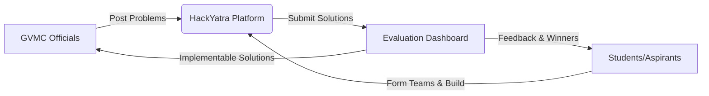

# HackYatra 🚀

> **Tagline:** Bridging Civic Challenges with Student Innovation for a Smarter Vizag.

## Vision Statement
To transform Greater Visakhapatnam into a beacon of civic innovation by empowering the next generation of technologists to collaboratively solve real-world urban challenges alongside the Greater Visakhapatnam Municipal Corporation (GVMC).

---

## 🛑 Problem Statement
The Greater Visakhapatnam Municipal Corporation (GVMC) faces numerous infrastructural and civic challenges—ranging from pothole repairs and solid waste management to water supply distribution and drainage maintenance. Traditional bureaucratic channels are often slow to adopt innovative, tech-driven solutions. Simultaneously, thousands of talented students and tech aspirants lack access to real-world, high-impact problems where they can apply their skills. There is a disconnect between those with the problems and those with the potential to solve them.

---

## 💡 Solution Overview
HackYatra is a highly scalable, AI-powered civic innovation platform that acts as the primary bridge between GVMC and the student community. GVMC officials can seamlessly post and categorize civic problem statements. Students can browse these challenges, use AI to form well-balanced teams, prototype solutions, and submit their projects for evaluation.

Designed to support **100K+ concurrent users**, HackYatra ensures a robust, gamified, and seamless experience from problem discovery to solution deployment.

---

## 🌟 Key Features

### For Students & Aspirants
* **Authentication & Profiles:** Secure SSO, GitHub/LinkedIn integration, and dynamic skill portfolios.
* **Problem Discovery:** Rich browsing of GVMC challenges with advanced filtering.
* **AI-Powered Team Formation:** Smart matching algorithms to build balanced teams based on complementary skills.
* **Solution Submission:** Integrated workspace for code, architecture diagrams, and video pitch uploads.
* **Mentorship & Forums:** Direct access to industry mentors and peer-to-peer discussion boards.
* **Gamification:** Leaderboards, badges, and reputation points for active participation.
* **AI Project Assistant:** Idea generation and technical architecture recommendations tailored to problem statements.

### For GVMC Officials & Judges
* **Problem Management:** Easy-to-use dashboard to post, categorize, and update civic challenges.
* **Evaluation Dashboard:** Streamlined interface to review submissions, assign scores, and leave feedback.
* **AI-Assisted Code Review:** Automated preliminary analysis of code quality, security, and scalability for submitted solutions.
* **Progress Tracking:** Real-time monitoring of hackathon phases and team progress.

### For Platform Admins
* **Admin Panel:** Complete control over user moderation, content approval, and hackathon lifecycle management.
* **Analytics:** High-level metrics on user engagement, submission quality, and platform health.

---

## 🎯 Target Audience
1. **Students & Tech Aspirants:** University students, boot-camp graduates, and junior developers looking to build impactful portfolio projects.
2. **GVMC Officials:** Department heads and administrators seeking innovative solutions to urban problems.
3. **Mentors & Judges:** Industry professionals, seasoned engineers, and civic leaders volunteering their time to guide teams.

---

## 💎 Value Proposition

| Stakeholder | Value Derived |
| :--- | :--- |
| **Students** | Gain real-world experience, build a strong portfolio, network with mentors, and potentially see their code deployed in a real city infrastructure. |
| **GVMC** | Access a massive, untapped talent pool to crowdsource innovative, low-cost, and rapid tech solutions for pressing civic issues. |
| **The City of Vizag** | Accelerated technological advancement, improved public services, and a stronger local tech ecosystem. |

---

## 📈 Success Metrics (KPIs)
* **User Growth:** Reach and maintain 100K+ concurrent active users during peak hackathon events.
* **Engagement Rate:** Number of teams formed per hackathon and the ratio of completed submissions to registrations.
* **Solution Adoption:** Percentage of winning solutions successfully piloted or integrated by GVMC.
* **Platform Performance:** 99.99% uptime and <200ms API response times under load.
* **AI Efficacy:** High satisfaction scores on AI team matching and AI-assisted judge reviews.

---

## 🏗️ Technical Stack & Scale
* **Frontend:** Next.js, React, Tailwind CSS
* **Backend:** Python, FastAPI
* **Database:** PostgreSQL
* **Scale Target:** Architected for 100K+ concurrent users (using caching, async workers, and horizontal scaling).

---

## 📊 Project Status & Links
**Current Status:** Architecture Phase / MVP Planning

### Related Documentation
* *Links to Architecture, API Specs, and setup guides will be added here as they are generated.*
