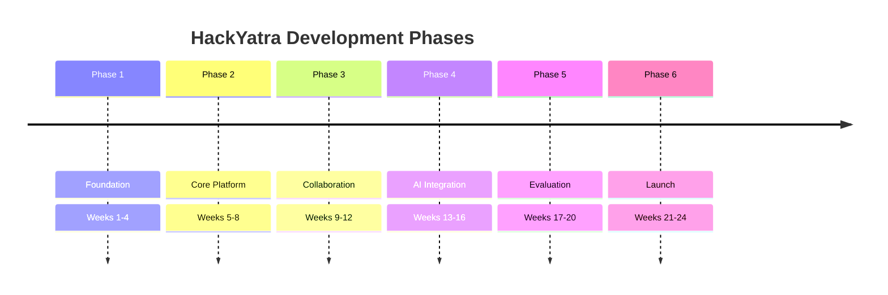
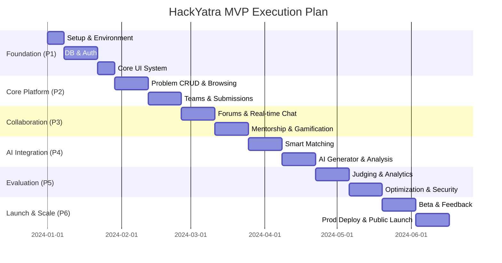

# HackYatra Project Roadmap

**HackYatra** is a large-scale civic innovation platform designed to bridge the gap between the Greater Visakhapatnam Municipal Corporation (GVMC) and student innovators. Built to scale to 100K+ concurrent users, the platform enables municipal problem solving through crowdsourced technological innovation.

This document outlines the comprehensive 24-week phased development roadmap for the startup Minimum Viable Product (MVP).

---

## 📈 Executive Timeline

## 📊 Master Gantt Chart

---

## 📅 Phased Execution Plan

### Phase 1: Foundation (Weeks 1-4)

Establishing the core architecture, dev-ops pipeline, and base functionality.

- **Objectives:**
  - Project setup, CI/CD pipelines, and development environment configuration.
  - Database design and migrations.
  - User authentication (Email, Google OAuth).
  - Basic user profiles (Students, Admins, Mentors).
  - Core UI framework and design system implementation.
- **Deliverables:** Functioning staging environment, secure auth flows, and comprehensive UI component library.
- **Dependencies:** Finalized branding guidelines and cloud infrastructure provisioning.
- **Success Criteria:** 90%+ test coverage on auth modules; CI/CD deploying successfully under 5 minutes.
- **Risk Assessment:**
  - _Risk:_ OAuth integration complexities.
  - _Mitigation:_ Use robust, established authentication providers (e.g., Auth0, Firebase Auth or NextAuth) to reduce custom implementation bugs.

### Phase 2: Core Platform (Weeks 5-8)

Building the primary workflow for civic problem solving.

- **Objectives:**
  - GVMC problem statement CRUD via admin panel.
  - Problem browsing, searching, and filtering for students.
  - Team creation, invitations, and role management.
  - Solution submission workflow.
  - Secure file upload system (S3/Cloud Storage).
  - Basic notification system (Email & In-App).
- **Deliverables:** End-to-end flow from problem posting by GVMC to solution submission by student teams.
- **Dependencies:** Completion of Phase 1 DB schemas and user roles.
- **Success Criteria:** Users can successfully form teams, select a problem, and submit a functional solution with attachments.
- **Risk Assessment:**
  - _Risk:_ File storage costs and malicious uploads.
  - _Mitigation:_ Implement strict MIME-type checking, file size limits (e.g., 50MB max), and virus scanning via cloud functions on upload.

### Phase 3: Collaboration & Engagement (Weeks 9-12)

Enhancing user interaction, retention, and support systems.

- **Objectives:**
  - Discussion forums scoped by problem statements.
  - Real-time chat (team channels & mentor DMs).
  - Mentorship system (booking, matching, feedback).
  - Progress tracking and milestone submissions.
  - Leaderboard and gamification (points, badges).
- **Deliverables:** Real-time communication hubs and engaging gamified dashboards.
- **Dependencies:** Phase 2 team formations and core entity relationships.
- **Success Criteria:** Sub-100ms latency on real-time chat messages; accurate gamification ledger.
- **Risk Assessment:**
  - _Risk:_ Real-time WebSocket connection overhead scaling poorly.
  - _Mitigation:_ Utilize managed WebSocket services (e.g., Pusher, Socket.io with Redis adapter, or AWS API Gateway WebSockets).

### Phase 4: AI Integration (Weeks 13-16)

Introducing intelligent features to differentiate the platform.

- **Objectives:**
  - Smart team matching (skill-based recommendation).
  - Problem recommendation engine for students.
  - AI idea generator / brainstorming assistant.
  - Automated submission analysis for plagiarism and baseline viability.
- **Deliverables:** AI microservices integrated seamlessly into the core user journey.
- **Dependencies:** Sufficient mock data or early beta data to tune recommendation algorithms.
- **Success Criteria:** AI matching yields a >60% acceptance rate on team invitations; analysis successfully flags duplicated solutions.
- **Risk Assessment:**
  - _Risk:_ High latency and API costs from LLM calls.
  - _Mitigation:_ Implement robust caching (Redis), rate-limiting per user, and utilize cost-effective models (e.g., Claude 3 Haiku or GPT-4o-mini) for high-volume tasks.

### Phase 5: Evaluation & Polish (Weeks 17-20)

Preparing the platform for production-grade workloads and final judging.

- **Objectives:**
  - Judging workflow and scoring dashboard.
  - Automated PDF certificate generation.
  - Comprehensive analytics dashboard for GVMC admins.
  - Performance optimization (DB indexing, CDN caching).
  - Comprehensive security audit (Pen-testing).
  - Load testing for up to 100K concurrent users.
- **Deliverables:** A secure, blazingly fast, and judged-ready MVP platform.
- **Dependencies:** Feature freeze on all prior phases.
- **Success Criteria:** System handles 100K simulated concurrent users with <500ms API response times. Zero critical security vulnerabilities.
- **Risk Assessment:**
  - _Risk:_ Database bottlenecks under heavy read/write load during judging.
  - _Mitigation:_ Introduce read replicas, aggressive query caching, and optimize database indexing.

### Phase 6: Launch & Scale (Weeks 21-24)

Taking HackYatra to the public and securing early adoption.

- **Objectives:**
  - Closed beta launch with select engineering colleges in Vizag.
  - Rapid iteration on user feedback.
  - Production deployment (multi-AZ redundancy).
  - Monitoring, alerting, and APM setup (Datadog/New Relic).
  - Public launch event and marketing push.
- **Deliverables:** Live, monitored production environment with active user base.
- **Dependencies:** Successful load testing and security sign-offs.
- **Success Criteria:** 99.9% uptime in the first month; smooth onboarding for the first 10,000 users.
- **Risk Assessment:**
  - _Risk:_ Unforeseen production edge cases causing downtime.
  - _Mitigation:_ Implement strict incident response playbooks, automated rollbacks, and active paging (PagerDuty).

---

## 🚀 Future Vision (Post-MVP)

As HackYatra solidifies its position as the premier civic innovation pipeline, the roadmap expands beyond the initial 6 phases:

| Initiative                   | Description                                                                                      | Impact                                                |
| :--------------------------- | :----------------------------------------------------------------------------------------------- | :---------------------------------------------------- |
| **Mobile Application**       | React Native-based iOS and Android apps for on-the-go collaboration.                             | Higher engagement, push notification immediacy.       |
| **Expansion Strategy**       | Rollout to other municipal corporations (e.g., GHMC, VMC) creating a statewide network.          | Drastically increased user base and civic impact.     |
| **E-Governance Integration** | API bridges to connect successful solutions directly with state government e-governance portals. | Seamless deployment of student innovations.           |
| **Live Event Streaming**     | In-platform streaming and broadcast tools for hackathon pitches and final presentations.         | Enhanced community building and transparency.         |
| **Blockchain Certificates**  | On-chain issuance of winning certificates to prevent fraud and ensure verifiability.             | Increased prestige and trust in platform credentials. |
