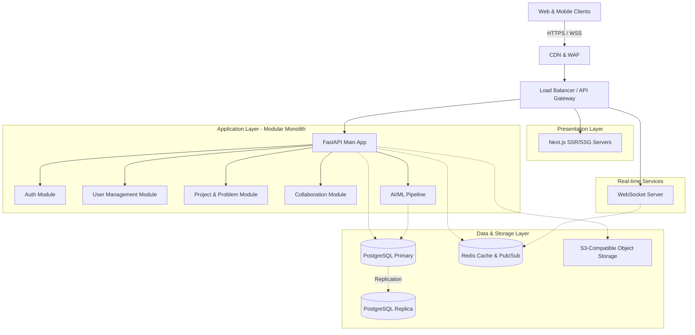
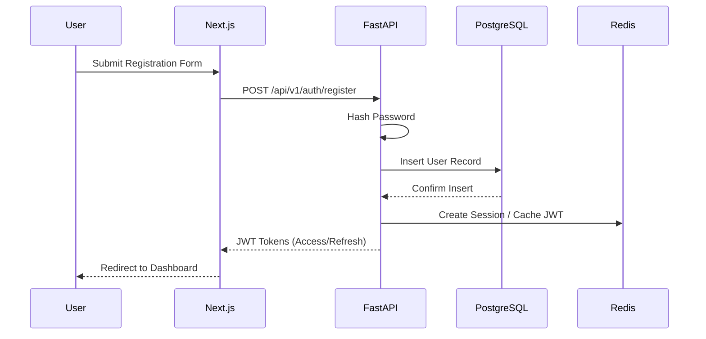
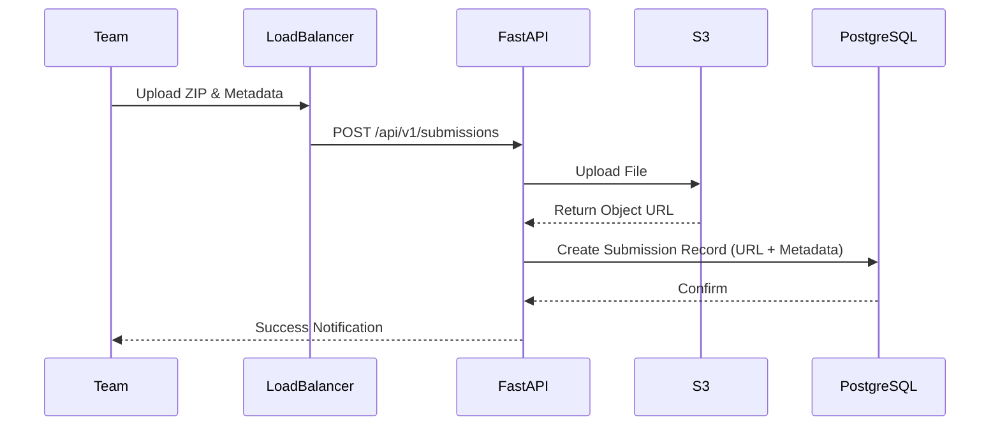
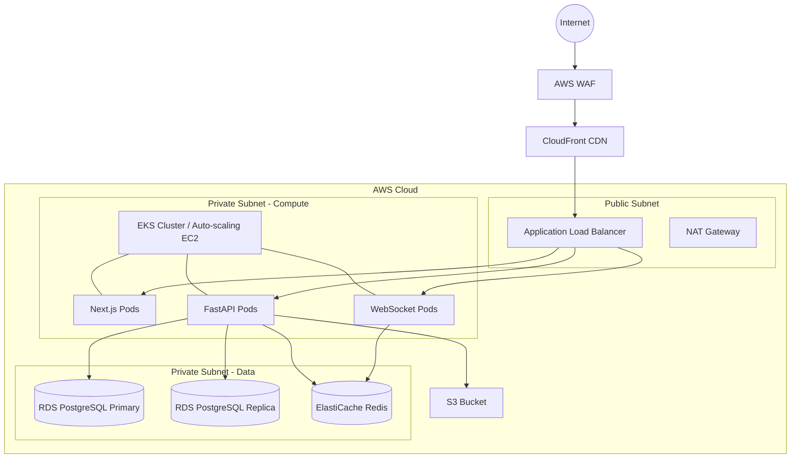

# HackYatra System Architecture

## 1. High-Level Architecture Overview

HackYatra is a scalable civic innovation platform designed to bridge the Greater Visakhapatnam Municipal Corporation (GVMC) with student innovators. The system is engineered to handle 100K+ concurrent users, ensuring high availability, low latency, and secure data handling.

## 2. System Components Breakdown

*   **Frontend (Presentation Layer)**
    *   **Next.js (React)**: Utilizes Server-Side Rendering (SSR) for dynamic content and SEO optimization (e.g., public problem statements), and Static Site Generation (SSG) for static pages.
    *   **CDN (Content Delivery Network)**: Caches static assets, improving load times globally and offloading traffic from origin servers.
*   **API Gateway & Load Balancer**
    *   Acts as the single entry point for all API requests. Handles SSL termination, rate limiting, request routing, and DDoS protection.
*   **Backend Services (FastAPI)**
    *   Highly concurrent asynchronous Python web framework handling business logic.
    *   Manages users, authentication, problem statements, submissions, and evaluation logic.
*   **Database Layer**
    *   **PostgreSQL**: Primary relational database for structured data (Users, Teams, Problems, Submissions).
    *   **Redis**: In-memory data structure store used for session management, caching hot data, and pub/sub for WebSockets.
*   **AI/ML Pipeline**
    *   Python-based sub-system for tasks like automated code evaluation, plagiarism detection, and smart team matching.
*   **File Storage**
    *   **S3-Compatible Storage**: Scalable object storage for user avatars, project attachments, and submission files.
*   **Notification & Real-time Service**
    *   Dedicated WebSocket servers integrated with Redis Pub/Sub for real-time chat, live notifications, and status updates.

## 3. Microservices vs. Modular Monolith

**Decision:** Modular Monolith for MVP, with a clear path to Microservices.

**Rationale:**
Starting with a microservices architecture for an MVP introduces unnecessary operational complexity, overhead in inter-service communication, and distributed data management challenges. A **Modular Monolith** allows us to maintain a single deployment unit while strictly enforcing logical boundaries between domains (e.g., `auth`, `users`, `problems`, `submissions`). 

As the platform scales beyond 100K concurrent users or as domain teams grow, specific modules (like the AI pipeline or WebSocket servers) can be seamlessly extracted into independent microservices without a complete system rewrite.

## 4. Data Flow Diagrams

### User Registration & Auth

### Solution Submission

## 5. Scalability Strategy

To support 100K+ concurrent users, the architecture employs a multi-tiered scaling strategy:

*   **Stateless Compute:** Next.js and FastAPI instances are completely stateless, allowing for aggressive horizontal auto-scaling based on CPU/Memory metrics.
*   **Caching Strategy:**
    *   **CDN Edge Caching:** Static assets and public API responses (e.g., active problem statements) are cached at the edge.
    *   **Application Caching (Redis):** Frequently accessed database queries, session states, and leaderboard data are cached in Redis.
*   **Database Scaling:**
    *   **Read Replicas:** PostgreSQL read replicas are utilized to offload read-heavy operations (e.g., viewing public projects, leaderboards) from the primary writer node.
    *   **Connection Pooling:** PgBouncer is used to manage database connections efficiently across thousands of FastAPI workers.
*   **Asynchronous Processing:** Heavy operations (e.g., email sending, AI evaluations) are offloaded to background worker queues (e.g., Celery + Redis).

## 6. Security Architecture

*   **Authentication & Authorization:** 
    *   Stateless JWT (JSON Web Tokens) for authentication.
    *   Role-Based Access Control (RBAC) implemented at the API level (roles: `Student`, `Mentor`, `Judge`, `GVMC_Admin`, `SuperAdmin`).
*   **API Security:**
    *   Strict input validation using Pydantic (FastAPI).
    *   Rate limiting per IP and per user account at the API Gateway to prevent brute force and DoS attacks.
    *   Strict CORS policies configured.
*   **Data Protection:**
    *   All data in transit encrypted via TLS 1.3 (HTTPS/WSS).
    *   Sensitive data at rest (passwords, API keys) strongly hashed (e.g., Argon2) or encrypted.
*   **Infrastructure Security:**
    *   VPC isolation: Databases and internal caches are in private subnets, inaccessible directly from the public internet.

## 7. Infrastructure Deployment Diagram (Cloud - AWS Recommendation)

## 8. Monitoring & Observability

*   **Logging:** Centralized structured logging (JSON format) using ELK Stack (Elasticsearch, Logstash, Kibana) or Datadog.
*   **Metrics:** Prometheus for scraping system and application metrics; Grafana for visualization dashboards.
*   **Tracing:** OpenTelemetry integrated into FastAPI and Next.js for distributed tracing across services to identify bottlenecks.
*   **Alerting:** PagerDuty / Slack integration triggered by Prometheus Alertmanager for critical thresholds (e.g., 5xx error spikes, high database CPU).

## 9. Disaster Recovery & Backup Strategy

*   **Database Backups:** Automated daily snapshots of PostgreSQL with Point-In-Time Recovery (PITR) enabled for up to 7 days.
*   **Object Storage:** S3 versioning enabled to protect against accidental deletion of user uploads.
*   **Infrastructure as Code (IaC):** Entire infrastructure provisioned via Terraform/Pulumi, allowing rapid redeployment in a secondary region if the primary region fails.
*   **Failover:** Multi-AZ (Availability Zone) deployment for RDS and ElastiCache to handle localized datacenter outages automatically.

## 10. Performance Targets & SLAs

*   **Availability:** 99.9% uptime (approx. 43 minutes downtime/month).
*   **Latency:**
    *   P95 API Response Time: < 200ms
    *   Static Asset Load Time: < 50ms (via CDN)
*   **Throughput:** System designed to handle peaks of 5,000 requests per second (RPS) easily scaling up to accommodate the 100K+ concurrent user connections (primarily WebSockets).

## 11. Technology Decisions & Trade-offs

| Component | Choice | Trade-off / Rationale |
| :--- | :--- | :--- |
| **Backend Framework** | FastAPI (Python) | High performance via Starlette/Pydantic, easy ML integration. Trade-off: Python GIL limits single-process CPU bound tasks (mitigated via background workers). |
| **Architecture** | Modular Monolith | Faster MVP iteration and simpler deployment. Trade-off: Requires strict team discipline to maintain module boundaries to prevent spaghetti code. |
| **Database** | PostgreSQL | Robust, ACID compliant, excellent JSONB support for semi-structured data. Trade-off: Vertical scaling is expensive; requires read-replicas early for massive scale. |
| **State / Cache** | Redis | Lightning fast, excellent Pub/Sub for WebSockets. Trade-off: In-memory nature means data loss on crash if persistence isn't configured correctly. |
| **Frontend** | Next.js | Great developer experience, SSR for SEO. Trade-off: Adds Node.js infrastructure complexity compared to a pure SPA (Single Page Application). |
