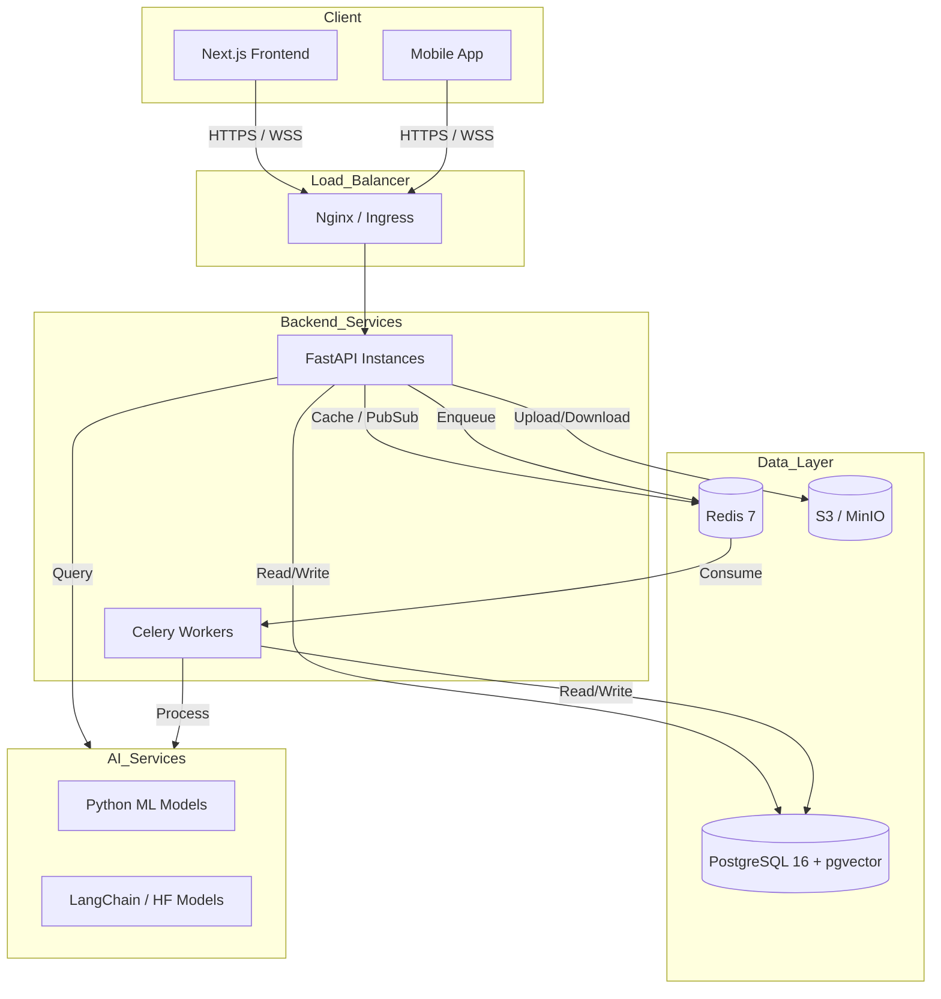

# HackYatra Technology Stack

This document outlines the comprehensive technology stack for HackYatra, a large-scale civic innovation platform designed to support 100K+ concurrent users. Every technology choice has been made to ensure scalability, performance, developer productivity, and maintainability.

## 1. Frontend Architecture

The frontend is designed for high performance, SEO optimization, and a seamless developer experience, heavily relying on the React ecosystem.

| Technology | Version | Purpose | Justification | Alternatives Considered |
| :--- | :--- | :--- | :--- | :--- |
| **Next.js** | 14+ | React Framework (App Router, SSR, SSG, ISR) | Provides excellent SEO, fast page loads via server-side rendering, and a robust routing system. App Router enables streaming and React Server Components. | Vite (Lacks built-in SSR/SEO focus), Create React App (Deprecated) |
| **React** | 18+ | UI Library | Industry standard, massive ecosystem, concurrent rendering features improve UI responsiveness. | Vue, Svelte (Chosen React for broader talent pool and ecosystem) |
| **TypeScript** | 5+ | Static Typing | Reduces runtime errors, improves developer experience with better autocomplete and refactoring. | JavaScript (Too error-prone at scale) |
| **Zustand** / **Redux Toolkit** | Latest | Client State Management | Zustand for simpler, boilerplate-free state; RTK if complex state machines are needed. | Recoil, Jotai |
| **TanStack Query** | 5+ | Server State Management | Handles caching, deduplication, and background updates for API requests effortlessly. | SWR, Apollo Client (GraphQL specific) |
| **Tailwind CSS** | 3+ | Styling | Utility-first approach speeds up development and keeps CSS bundle sizes small. | CSS Modules, Styled Components (Runtime overhead) |
| **shadcn/ui** | Latest | UI Components | Accessible, customizable components that you own the code for, rather than an opaque dependency. | Material UI, Chakra UI (Harder to customize deeply) |
| **Framer Motion** | 11+ | Animations | Declarative, physics-based animations that perform well and are easy to write. | CSS Transitions, React Spring |
| **Socket.io-client** | 4+ | Real-time Communication | Robust WebSocket wrapper with fallback to HTTP long-polling and automatic reconnection. | Native WebSockets (Lacks fallbacks/reconnect) |
| **Recharts / Chart.js** | Latest | Data Visualization | Recharts provides composable React components for D3; Chart.js is great for standard charts. | D3.js (Steep learning curve) |
| **React Hook Form + Zod**| Latest | Form Handling & Validation | Performant form state management with strict schema-based validation. | Formik, Yup (Slower, larger bundle) |

## 2. Backend Architecture

The backend is built for high throughput, asynchronous processing, and rapid API development.

| Technology | Version | Purpose | Justification | Alternatives Considered |
| :--- | :--- | :--- | :--- | :--- |
| **Python** | 3.11+ | Programming Language | Excellent ecosystem for AI/ML, fast enough for web serving when paired with async frameworks. | Go, Node.js (Chosen Python for AI/ML ecosystem synergy) |
| **FastAPI** | Latest | Web Framework | Extremely fast, async-native, automatic OpenAPI documentation, relies on Pydantic for validation. | Django, Flask (Slower, not async-first) |
| **SQLAlchemy** | 2.0+ | ORM (Async) | Powerful, flexible ORM that now fully supports async data access. | Tortoise ORM, SQLModel |
| **Alembic** | Latest | Database Migrations | Industry standard for SQLAlchemy migrations. | Django Migrations (Coupled to Django) |
| **Pydantic** | v2 | Data Validation | Written in Rust, blazing fast validation and settings management. | Marshmallow |
| **Celery** | Latest | Task Queue / Background Jobs | Robust, distributed task queue for heavy processing (email, reports, ML tasks). | RQ, ARQ |
| **Redis** | 7+ | Broker for Celery, Caching | In-memory data store used as Celery broker and result backend. | RabbitMQ (Chosen Redis for dual use as cache) |
| **WebSockets** | Built-in | Real-time Communication | Handled natively by FastAPI/Starlette for low-latency updates (chat, live feeds). | SSE, Polling |
| **python-jose** | Latest | JWT & Authentication | Secure JWT encoding/decoding for stateless authentication. | PyJWT |
| **Boto3** | Latest | S3/Object Storage SDK | AWS SDK for Python to handle file uploads/downloads. | Minio SDK |

## 3. Database & Storage

Data persistence focuses on reliability, relational integrity, and scalable object storage.

| Technology | Version | Purpose | Justification | Alternatives Considered |
| :--- | :--- | :--- | :--- | :--- |
| **PostgreSQL** | 16+ | Primary Relational Database | Advanced, open-source RDBMS with excellent JSON support and extensibility. | MySQL, MongoDB (Postgres offers better relational integrity and JSONB) |
| **Redis** | 7+ | Caching, Sessions, Rate Limiting, Pub/Sub | Extremely fast in-memory store, essential for scaling to 100K users and managing WebSocket pub/sub. | Memcached (Lacks data structures and persistence) |
| **MinIO / AWS S3** | Latest | Object Storage | Scalable storage for user-uploaded assets (images, documents). MinIO for self-hosted, S3 for cloud. | Local File System (Doesn't scale horizontally) |
| **pgvector** | Latest | Postgres Extension | Native vector search capabilities within Postgres for AI embeddings, reducing infrastructure complexity. | Pinecone, Milvus (Adds another operational dependency) |

## 4. AI & Machine Learning

AI integration is a core feature for smart matching and recommendations.

| Technology | Version | Purpose | Justification | Alternatives Considered |
| :--- | :--- | :--- | :--- | :--- |
| **scikit-learn** | Latest | ML Algorithms (Team matching, etc.) | Industry standard for traditional ML models, clustering, and simple recommenders. | PyTorch/TensorFlow (Overkill for traditional ML) |
| **Sentence Transformers**| Latest | Embeddings & NLP | High-quality text embeddings for semantic search and matching. | OpenAI API (Using local models saves cost, but OpenAI is a fallback) |
| **LangChain** | Latest | AI Pipeline Orchestration | Framework for developing applications powered by language models (RAG, agents). | LlamaIndex (LangChain is more general purpose) |
| **Hugging Face** | Latest | Model Hub | Access to open-source models for various NLP/Vision tasks. | Proprietary APIs |

## 5. DevOps & Infrastructure

Infrastructure is designed to be highly available, scalable, and fully automated.

| Technology | Version | Purpose | Justification | Alternatives Considered |
| :--- | :--- | :--- | :--- | :--- |
| **Docker & Docker Compose**| Latest | Containerization & Dev Env | Ensures consistency across environments; Compose makes local orchestration easy. | Vagrant |
| **Kubernetes / AWS ECS**| Latest | Container Orchestration (Prod) | Essential for scaling microservices to handle 100K+ concurrent connections automatically. | Docker Swarm, Heroku (Cannot handle the scale cost-effectively) |
| **Nginx** | Latest | Reverse Proxy / Ingress | High-performance load balancing, SSL termination, and static file serving. | Traefik, HAProxy |
| **GitHub Actions** | Latest | CI/CD | Integrated closely with code, powerful runner ecosystem for automated testing and deployment. | Jenkins, GitLab CI |
| **Prometheus + Grafana** | Latest | Monitoring & Alerting | Industry standard for metric collection and dashboarding. | Datadog (Expensive at scale) |
| **ELK Stack / Loki** | Latest | Centralized Logging | ELK for complex log analysis; Loki for cost-effective, Kubernetes-native log aggregation. | Splunk |
| **Terraform** | Latest | Infrastructure as Code (IaC) | Declarative infrastructure provisioning across cloud providers. | AWS CloudFormation (Vendor lock-in) |

## 6. Testing & Quality Assurance

Rigorous testing ensures platform stability under high load.

| Technology | Version | Purpose | Justification | Alternatives Considered |
| :--- | :--- | :--- | :--- | :--- |
| **Pytest** | Latest | Backend Unit/Integration Testing | Minimal boilerplate, powerful fixtures, widely adopted in the Python ecosystem. | Unittest |
| **Jest + RTL** | Latest | Frontend Unit/Component Testing | RTL encourages testing behavior over implementation details. | Mocha/Chai, Enzyme (Deprecated) |
| **Playwright** | Latest | End-to-End (E2E) Testing | Faster and more reliable than Cypress, supports multiple browsers natively. | Cypress, Selenium |
| **Locust** | Latest | Load Testing | Python-based, scalable load testing tool to simulate 100K+ concurrent users. | JMeter, k6 (Locust uses Python, aligning with our backend stack) |

## Architecture Diagram (Logical)

## Conclusion

This stack utilizes modern, battle-tested technologies. The combination of Next.js and FastAPI provides a highly performant and developer-friendly environment. Postgres and Redis ensure robust data persistence and caching, essential for reaching the 100K+ concurrent user milestone. The AI integration points are decoupled to allow independent scaling.
