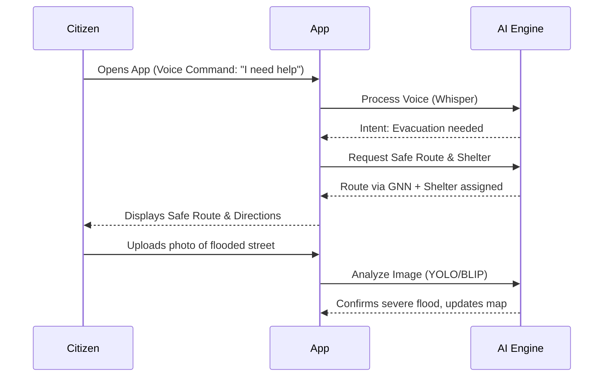
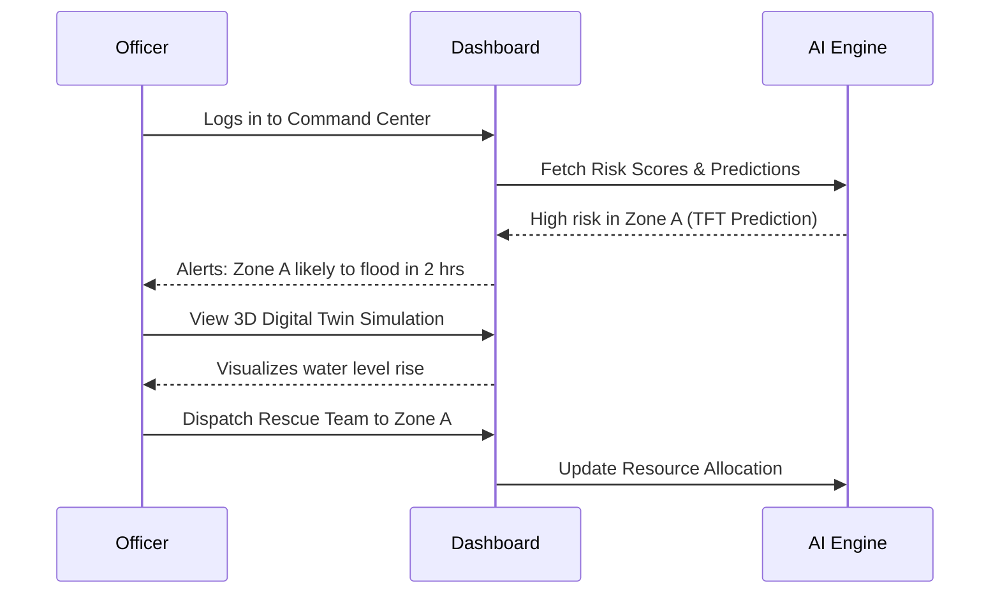

# Solution Overview: FloodGuard AI

## 1. Platform Vision
FloodGuard AI is envisioned as a comprehensive, end-to-end intelligence ecosystem that anticipates urban flooding before it occurs, guides citizens safely through the crisis, and empowers authorities with unparalleled situational awareness. It transforms disparate data streams into actionable, life-saving intelligence.

## 2. High-Level Architecture

```mermaid
graph TD
    subgraph Data Sources
        W[Weather APIs]
        S[IoT Sensors]
        C[Citizen Reports]
        H[Historical Data]
    end

    subgraph Core Backend FastAPI / Python
        DB[(PostgreSQL + PostGIS)]
        R[(Redis)]
        CEL[Celery Workers]
        Auth[Role-based Auth]
    end

    subgraph AI/ML Engine
        TFT[Street-level Prediction TFT]
        GNN[Smart Evacuation GNN]
        CV[Crowd Report AI YOLOv11 + BLIP-2]
        NLP[Multilingual Voice Whisper]
        Risk[AI Risk Scoring XGBoost]
    end

    subgraph Frontend Interfaces React / Vite
        UI_Cit[Citizen Portal]
        UI_Gov[Gov Analytics Dashboard]
        DT[3D Digital Twin CesiumJS]
    end

    W --> Core Backend
    S --> Core Backend
    C --> CV
    C --> Core Backend
    H --> Risk
    H --> TFT

    Core Backend <--> AI/ML Engine
    DB <--> Core Backend
    R <--> Core Backend
    CEL <--> Core Backend

    Core Backend --> UI_Cit
    Core Backend --> UI_Gov
    Core Backend --> DT
    Auth --> UI_Cit
    Auth --> UI_Gov
```

## 3. Module Summaries

1. **AI Flood Risk Scoring:** Utilizes XGBoost models trained on historical flood data, elevation, and drainage networks to assign dynamic risk scores to specific neighborhoods, enabling pre-emptive resource staging.
2. **Street-level Flood Prediction:** Leverages Temporal Fusion Transformers (TFT) to process time-series data (rainfall, tidal levels) and forecast localized water logging depths hours in advance.
3. **Smart Evacuation Route Planning:** Employs Graph Neural Networks (GNN) on top of road network data (OSM/Mapbox) to continuously calculate the safest, fastest evacuation routes, actively avoiding predicted or reported flooded nodes.
4. **Shelter Recommendation Engine:** A geospatial matching algorithm that directs users to the nearest open relief camps, balancing real-time capacity data to prevent overcrowding.
5. **Crowd Reporting with AI Image Analysis:** Citizens upload photos of flooding. YOLOv11 detects objects (people, cars, debris), while BLIP-2 generates contextual descriptions and estimates severity, automating triage for authorities.
6. **Multilingual Voice Assistant:** Integrates OpenAI's Whisper to allow users to interact, report emergencies, and receive instructions via voice in local languages (e.g., Telugu, Hindi, English).
7. **Government Analytics Dashboard:** A comprehensive React/Mapbox-based command center visualizing live predictions, deployed resources, citizen reports, and shelter status on a unified map.
8. **Flood Digital Twin:** A 3D interactive model built with CesiumJS and Three.js, allowing officials to visualize flood propagation scenarios in a highly realistic urban environment.
9. **Historical Flood Analytics:** A data exploration module that visualizes past flood extents and impacts, aiding in long-term infrastructure planning and policy-making.
10. **Weather Monitoring:** Continuous ingestion and visualization of hyper-local meteorological data, serving as the foundational input for all predictive models.
11. **Role-based Authentication:** Secure, segmented access ensuring Citizens see relevant guidance, Government Officers access command tools, and Admins manage system configurations.

## 4. Data Flow Overview
Data enters the platform from external APIs (weather, tides) and crowdsourced citizen reports. The FastAPI backend orchestrates these inputs, passing time-series data to the TFT models and images to the Vision models via Celery asynchronous task queues. The resulting predictions and classifications are stored in PostGIS. The Graph Neural Network then recalculates safe routes based on this updated spatial data. Finally, these insights are pushed via WebSockets to the React frontend, updating the Digital Twin and dashboards in real-time.

## 5. User Journey Maps

### Citizen Journey


### Government Officer Journey


## 6. Key Innovations & Differentiators
- **Hyper-Local Precision:** Moving beyond city-wide alerts to street-level, actionable intelligence using TFTs.
- **Dynamic Routing:** Unlike Google Maps which may not quickly reflect flood blockages, our GNN actively routes *away* from water.
- **Verified Crowd Intelligence:** Automated AI verification (YOLO+BLIP) of citizen reports prevents spam and accelerates response without human bottlenecks.
- **Accessibility First:** The multilingual voice assistant ensures the most vulnerable populations can access the platform seamlessly.

## 7. Platform Principles
- **Real-Time:** Minimal latency between data ingestion and insight generation.
- **Predictive:** Focus on anticipation rather than reaction.
- **Inclusive:** Accessible to all demographics regardless of language or tech-literacy.
- **Scalable:** Cloud-native architecture designed to expand rapidly to 10+ cities.
- **Open-Data:** Built on open standards (GeoJSON, OSM) to facilitate collaboration.

## 8. Success Criteria
- Successful prediction of flood events with >85% accuracy at the neighborhood level.
- Processing and verification of citizen reports within 5 seconds.
- Maintaining 99.9% uptime during peak storm events.
- Positive user acceptance testing from GVMC officials and sample citizen groups.
