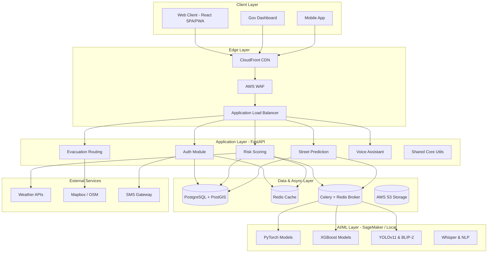
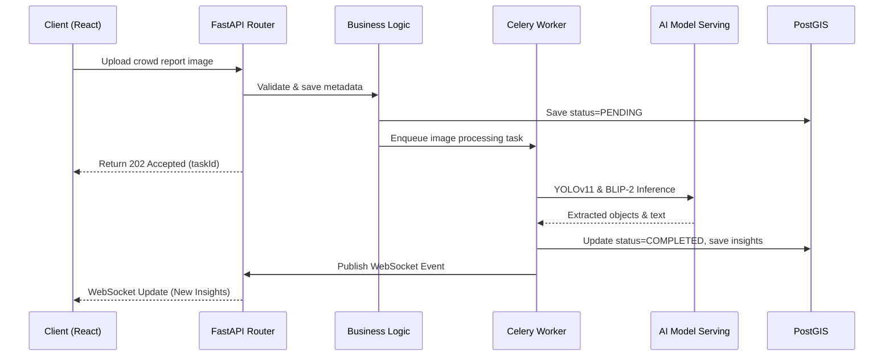
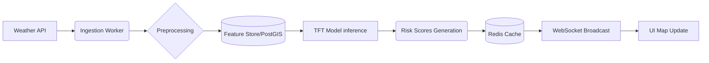
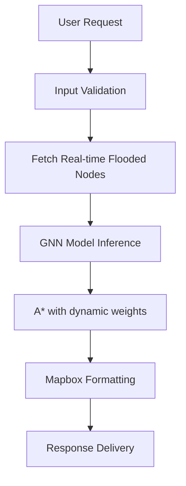

# Software Architecture - FloodGuard AI

This document outlines the software architecture for FloodGuard AI, designed to scale to 100K+ concurrent users across multiple cities.

## 1. Architecture Style

FloodGuard AI follows a **Modular Monolith** architecture style. The system is designed with strict boundaries between domains (modules) to prevent spaghetti dependencies, allowing for an easy transition to a Microservices architecture as the platform scales globally.

## 2. High-Level Architecture

## 3. Component Interaction

Modules communicate primarily via in-memory function calls, respecting interface boundaries. For asynchronous processing, they use Celery tasks.

## 4. Data Flow Architectures

### Flood Prediction Pipeline

### Evacuation Routing

## 5. Integration Architecture

- **Mapbox & OSM**: Used for rendering basemaps, 3D terrain, and geocoding.
- **Weather APIs (OpenWeather, NOAA)**: Polled periodically for rainfall predictions and radar data.
- **AWS S3**: Storage for crowd reports, historical data dumps, and model checkpoints.
- **Twilio/SNS**: For SMS alerts and mass notifications.

## 6. Event-Driven Patterns

- **WebSockets (FastAPI + Broadcaster)**: Push real-time risk map updates, new crowd reports, and critical alerts directly to connected web clients.
- **Celery Tasks**: Used for compute-heavy ML inference, batch data processing, and asynchronous email/SMS notifications.
- **Pub/Sub**: Redis Pub/Sub drives the WebSocket broadcasting mechanism across multiple API instances.

## 7. Caching Strategy

- **Layer 1: CDN Edge Cache**: Static assets, public dashboard summaries.
- **Layer 2: Redis Query Cache**: Expensive aggregate queries (e.g., city-wide risk averages).
- **Layer 3: Geospatial Cache**: Redis GEORADIUS for fast spatial lookups of nearby shelters.
- **Invalidation**: Event-driven invalidation when data changes (e.g., risk level updates invalidate dashboard caches).

## 8. Error Handling Architecture

- **Circuit Breakers (Resilience4j style)**: Implemented for external API calls (e.g., Weather API goes down, we fallback to historical averages).
- **Retry Policies**: Exponential backoff via Celery for failed background tasks.
- **Global Exception Handlers**: Standardized JSON problem details for API errors (RFC 7807).

## 9. Cross-Cutting Concerns

- **Logging**: Structlog for JSON structured logging. Shipped to ELK/CloudWatch.
- **Tracing**: OpenTelemetry auto-instrumentation for tracing requests from React -> FastAPI -> Celery -> DB.
- **Authentication**: JWT-based stateless auth middleware.

## 10. Architecture Decision Records (ADRs)

### ADR 1: Modular Monolith over Microservices
- **Context**: Rapid MVP development while preparing for 100K users.
- **Decision**: Use a single FastAPI application with strictly bounded context modules.
- **Rationale**: Avoids network overhead and operational complexity of microservices, while enforcing clean interfaces that can be split later.

### ADR 2: FastAPI over Django
- **Context**: Need high-concurrency async support for WebSockets and ML serving.
- **Decision**: FastAPI.
- **Rationale**: Native `asyncio` support, Pydantic validation, excellent performance, and built-in OpenAPI docs.

### ADR 3: PostgreSQL + PostGIS over MongoDB
- **Context**: Heavy geospatial querying and complex relationships (routes, shelters, risk zones).
- **Decision**: PostgreSQL with PostGIS extension.
- **Rationale**: Unmatched spatial querying capabilities, ACID compliance, and maturity in the GIS space.

### ADR 4: Celery over Native Async for Tasks
- **Context**: Need to run YOLOv11 and PyTorch inferences.
- **Decision**: Celery with Redis broker.
- **Rationale**: Native async blocks the event loop for CPU-bound ML tasks. Celery offloads this to separate worker processes, allowing independent scaling of ML workers.
