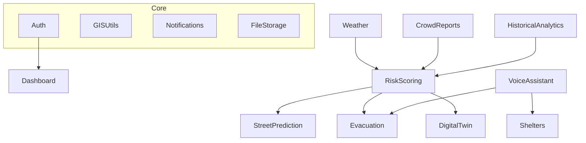

# Module Breakdown - FloodGuard AI

This document provides a detailed breakdown of the 11 functional modules and shared core components that make up the FloodGuard AI platform.

## Module Dependency Graph

## 1. AI Risk Scoring (M-01)
- **Purpose**: Calculates real-time flood risk scores for regions using weather data and historical context.
- **Models**: XGBoost Regressor (Features: Rainfall intensity, elevation, soil moisture).
- **DB Tables**: `risk_zones`, `risk_history`.
- **API**: `GET /api/v1/risk/zones`, `GET /api/v1/risk/heatmap`.
- **Background Tasks**: `update_risk_scores_hourly`.

## 2. Street Prediction (M-02)
- **Purpose**: Predicts exact street-level inundation depths.
- **Models**: Temporal Fusion Transformer (TFT).
- **DB Tables**: `street_nodes`, `inundation_predictions`.
- **API**: `GET /api/v1/predictions/streets`.

## 3. Evacuation Routing (M-03)
- **Purpose**: Calculates the safest dynamic routes avoiding flooded streets.
- **Models**: GNN-PyG for dynamic edge weight adjustment + A* routing.
- **DB Tables**: `evacuation_routes`.
- **API**: `POST /api/v1/evacuation/route`.

## 4. Shelter Engine (M-04)
- **Purpose**: Manages shelter capacity, locations, and resources.
- **DB Tables**: `shelters`, `shelter_inventory`.
- **API**: `GET /api/v1/shelters`, `PATCH /api/v1/shelters/{id}/capacity`.

## 5. Crowd Reporting (M-05)
- **Purpose**: Ingests crowdsourced images/text of flooding.
- **Models**: YOLOv11 (Water depth estimation), BLIP-2 (Image captioning).
- **DB Tables**: `crowd_reports`.
- **API**: `POST /api/v1/reports`.
- **Tasks**: `process_image_report`.

## 6. Voice Assistant (M-06)
- **Purpose**: Multilingual voice interface for SOS and information.
- **Models**: OpenAI Whisper (ASR), LLM Intent classification.
- **API**: `POST /api/v1/voice/query`.

## 7. Gov Dashboard (M-07)
- **Purpose**: High-level analytics and control center for officials.
- **DB Tables**: `dashboard_configs`.
- **API**: `GET /api/v1/dashboard/stats`.

## 8. Digital Twin (M-08)
- **Purpose**: 3D representation of the city with simulated flood physics.
- **Tech**: CesiumJS, Three.js, GeoJSON integration.
- **API**: `GET /api/v1/twin/assets`.

## 9. Historical Analytics (M-09)
- **Purpose**: Long-term trend analysis and report generation.
- **DB Tables**: `historical_events`.
- **Tasks**: `generate_monthly_report`.

## 10. Weather Monitoring (M-10)
- **Purpose**: Ingests and normalizes data from third-party weather APIs.
- **DB Tables**: `weather_readings`.
- **Tasks**: `poll_weather_apis_5m`.

## 11. Authentication (M-11)
- **Purpose**: JWT, RBAC, OAuth2 integration.
- **DB Tables**: `users`, `roles`, `sessions`.
- **API**: `POST /api/v1/auth/login`.

## Shared Core Modules

### Notification Service
- Handles push, SMS (Twilio), and email alerts based on urgency.

### File Storage Service
- S3 wrapper for images, audio, and report PDFs.

### GIS Utilities
- Helper functions for PostGIS queries (distance, bounding box, intersections).

### Audit Logging
- Logs critical actions (e.g., triggering a city-wide alarm).

### Rate Limiting
- Redis-based sliding window rate limiter to protect public endpoints.
