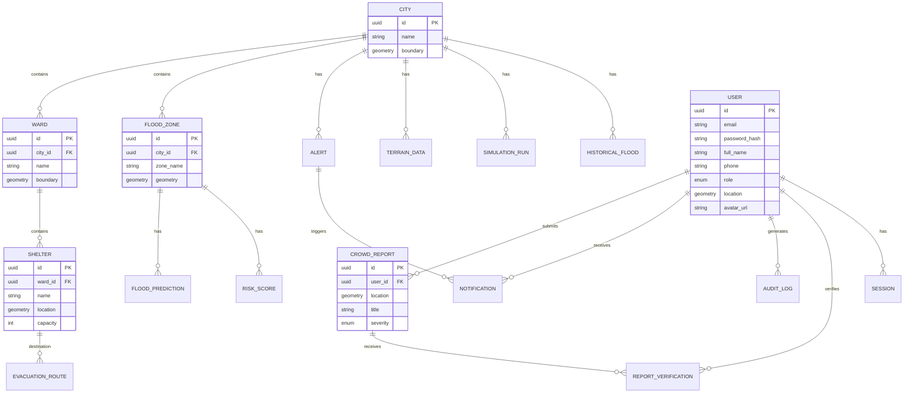

# Database Design

## 1. ER Diagram



## 2. Table Definitions

### Core Tables

#### `users`
Core user account information.
| Column | Type | Constraints | Description |
|---|---|---|---|
| `id` | UUID | PK | Unique identifier |
| `email` | VARCHAR(255) | UNIQUE, NOT NULL | User email address |
| `password_hash` | VARCHAR(255) | NOT NULL | Bcrypt password hash |
| `full_name` | VARCHAR(255) | NOT NULL | User's full name |
| `phone` | VARCHAR(20) | UNIQUE | Contact number |
| `role` | ENUM | NOT NULL, DEFAULT 'citizen' | `citizen`, `gov_officer`, `admin` |
| `language_pref` | VARCHAR(10) | DEFAULT 'en' | Preferred language code |
| `location` | GEOMETRY(Point, 4326) | NULL | Last known location |
| `avatar_url` | TEXT | NULL | Profile picture URL |
| `is_verified` | BOOLEAN | DEFAULT false | Email/phone verified status |
| `is_active` | BOOLEAN | DEFAULT true | Account status |
| `created_at` | TIMESTAMPTZ | DEFAULT NOW() | Creation timestamp |
| `updated_at` | TIMESTAMPTZ | DEFAULT NOW() | Last update timestamp |

#### `sessions`
Tracks active user sessions and refresh tokens.
| Column | Type | Constraints | Description |
|---|---|---|---|
| `id` | UUID | PK | Session ID |
| `user_id` | UUID | FK(users.id) | Associated user |
| `refresh_token` | VARCHAR(512) | UNIQUE, NOT NULL | JWT refresh token |
| `device_info` | JSONB | NULL | User agent and device details |
| `ip_address` | INET | NULL | Last seen IP |
| `expires_at` | TIMESTAMPTZ | NOT NULL | Token expiration |
| `created_at` | TIMESTAMPTZ | DEFAULT NOW() | Session creation |

### Flood Intelligence Tables

#### `flood_zones`
Pre-defined or dynamically generated zones susceptible to flooding.
| Column | Type | Constraints | Description |
|---|---|---|---|
| `id` | UUID | PK | Zone identifier |
| `city_id` | UUID | FK(cities.id) | Associated city |
| `zone_name` | VARCHAR(255) | NOT NULL | Human-readable name |
| `zone_type` | VARCHAR(50) | NOT NULL | e.g., 'residential', 'commercial' |
| `risk_level` | ENUM | NOT NULL | `low`, `medium`, `high`, `critical` |
| `geometry` | GEOMETRY(Polygon, 4326) | NOT NULL | Spatial boundary |
| `population` | INTEGER | DEFAULT 0 | Estimated population |
| `elevation_data` | JSONB | NULL | Granular elevation metrics |

#### `flood_predictions`
Time-series predictions for flood levels.
| Column | Type | Constraints | Description |
|---|---|---|---|
| `id` | UUID | PK | Prediction ID |
| `zone_id` | UUID | FK(flood_zones.id) | Target zone |
| `model_version` | VARCHAR(50) | NOT NULL | AI model version used |
| `prediction_time` | TIMESTAMPTZ | NOT NULL | Time the prediction applies to |
| `forecast_horizon` | INTEGER | NOT NULL | Hours into the future |
| `predicted_level` | NUMERIC(5,2) | NOT NULL | Predicted water level (meters) |
| `confidence` | NUMERIC(3,2) | NOT NULL | Confidence score (0-1) |
| `features_used` | JSONB | NULL | Data points that influenced prediction |
| `created_at` | TIMESTAMPTZ | DEFAULT NOW() | When prediction was generated |

#### `risk_scores`
Aggregated risk scores for zones based on multiple factors.
| Column | Type | Constraints | Description |
|---|---|---|---|
| `id` | UUID | PK | Score ID |
| `zone_id` | UUID | FK(flood_zones.id) | Target zone |
| `overall_score` | INTEGER | CHECK (0-100) | Composite risk score |
| `terrain_score` | INTEGER | CHECK (0-100) | Risk based on topology |
| `drainage_score` | INTEGER | CHECK (0-100) | Risk based on drainage capacity |
| `weather_score` | INTEGER | CHECK (0-100) | Risk based on current/forecast weather |
| `historical_score` | INTEGER | CHECK (0-100) | Risk based on past events |
| `calculated_at` | TIMESTAMPTZ | DEFAULT NOW() | Calculation time |
| `model_id` | VARCHAR(100) | NULL | Model reference |

#### `weather_data`
Raw and processed meteorological data.
| Column | Type | Constraints | Description |
|---|---|---|---|
| `id` | UUID | PK | Data point ID |
| `station_id` | VARCHAR(100) | NOT NULL | Weather station reference |
| `timestamp` | TIMESTAMPTZ | NOT NULL | Observation time |
| `rainfall_mm` | NUMERIC(6,2) | NOT NULL | Rainfall in mm |
| `temperature` | NUMERIC(4,1) | NULL | Temp in Celsius |
| `humidity` | INTEGER | NULL | Relative humidity % |
| `wind_speed` | NUMERIC(5,1) | NULL | Speed in km/h |
| `wind_direction` | INTEGER | NULL | Degrees (0-359) |
| `pressure` | NUMERIC(6,1) | NULL | Atmospheric pressure |
| `raw_data` | JSONB | NULL | Full payload from provider |

### Crowd Intelligence Tables

#### `crowd_reports`
User-submitted reports of flooding or hazards.
| Column | Type | Constraints | Description |
|---|---|---|---|
| `id` | UUID | PK | Report ID |
| `user_id` | UUID | FK(users.id) | Submitting user |
| `location` | GEOMETRY(Point, 4326) | NOT NULL | Report location |
| `title` | VARCHAR(255) | NOT NULL | Short summary |
| `description` | TEXT | NULL | Detailed description |
| `severity` | ENUM | NOT NULL | `minor`, `moderate`, `severe` |
| `status` | ENUM | DEFAULT 'pending' | `pending`, `verified`, `rejected` |
| `image_urls` | TEXT[] | NULL | Array of image URIs |
| `ai_analysis` | JSONB | NULL | YOLOv11/BLIP-2 results |
| `upvotes` | INTEGER | DEFAULT 0 | Community validation |
| `created_at` | TIMESTAMPTZ | DEFAULT NOW() | Submission time |

#### `report_verifications`
Gov officer verifications of crowd reports.
| Column | Type | Constraints | Description |
|---|---|---|---|
| `id` | UUID | PK | Verification ID |
| `report_id` | UUID | FK(crowd_reports.id) | Target report |
| `verified_by` | UUID | FK(users.id) | Officer ID |
| `status` | VARCHAR(50) | NOT NULL | New status applied |
| `notes` | TEXT | NULL | Officer comments |
| `created_at` | TIMESTAMPTZ | DEFAULT NOW() | Verification time |

### Evacuation & Shelter Tables

#### `shelters`
Designated safe zones and relief camps.
| Column | Type | Constraints | Description |
|---|---|---|---|
| `id` | UUID | PK | Shelter ID |
| `name` | VARCHAR(255) | NOT NULL | Shelter name |
| `address` | TEXT | NOT NULL | Physical address |
| `location` | GEOMETRY(Point, 4326) | NOT NULL | Spatial location |
| `capacity` | INTEGER | NOT NULL | Max people allowed |
| `current_occupancy` | INTEGER | DEFAULT 0 | Current head count |
| `amenities` | JSONB | NULL | Medical, food, power info |
| `accessibility_features` | TEXT[] | NULL | Wheelchair, etc. |
| `contact_phone` | VARCHAR(20) | NULL | On-site coordinator |
| `is_active` | BOOLEAN | DEFAULT true | Operational status |
| `ward_id` | UUID | FK(wards.id) | Associated ward |

#### `evacuation_routes`
Calculated safe paths to shelters.
| Column | Type | Constraints | Description |
|---|---|---|---|
| `id` | UUID | PK | Route ID |
| `origin` | GEOMETRY(Point, 4326) | NOT NULL | Starting point |
| `destination_shelter_id` | UUID | FK(shelters.id) | Target shelter |
| `route_geometry` | GEOMETRY(LineString, 4326) | NOT NULL | Path line |
| `distance_km` | NUMERIC(6,2) | NOT NULL | Total distance |
| `estimated_time_min` | INTEGER | NOT NULL | Walking/driving time |
| `risk_level` | VARCHAR(50) | NOT NULL | Safety assessment of route |
| `is_accessible` | BOOLEAN | DEFAULT true | Currently passable |
| `calculated_at` | TIMESTAMPTZ | DEFAULT NOW() | Calculation time |

### Administrative Tables

#### `cities`
Supported municipal regions.
| Column | Type | Constraints | Description |
|---|---|---|---|
| `id` | UUID | PK | City ID |
| `name` | VARCHAR(255) | NOT NULL | City name |
| `state` | VARCHAR(255) | NOT NULL | State/Province |
| `country` | VARCHAR(255) | NOT NULL | Country |
| `boundary` | GEOMETRY(MultiPolygon, 4326) | NOT NULL | City limits |
| `population` | INTEGER | NULL | Total population |
| `timezone` | VARCHAR(50) | NOT NULL | e.g., 'Asia/Kolkata' |

#### `wards`
Administrative subdivisions within cities.
| Column | Type | Constraints | Description |
|---|---|---|---|
| `id` | UUID | PK | Ward ID |
| `city_id` | UUID | FK(cities.id) | Associated city |
| `ward_number` | VARCHAR(50) | NOT NULL | Official designation |
| `name` | VARCHAR(255) | NOT NULL | Local name |
| `boundary` | GEOMETRY(Polygon, 4326) | NOT NULL | Ward limits |
| `population` | INTEGER | NULL | Ward population |
| `area_sq_km` | NUMERIC(8,2) | NULL | Area in sq km |

#### `alerts`
Official warnings and advisories.
| Column | Type | Constraints | Description |
|---|---|---|---|
| `id` | UUID | PK | Alert ID |
| `city_id` | UUID | FK(cities.id) | Target city |
| `zone_ids` | UUID[] | NULL | Specific affected zones |
| `alert_type` | ENUM | NOT NULL | `weather`, `evacuation`, `info` |
| `severity` | ENUM | NOT NULL | `info`, `warning`, `critical` |
| `title` | VARCHAR(255) | NOT NULL | Alert headline |
| `message` | TEXT | NOT NULL | Detailed instructions |
| `translations` | JSONB | NULL | Localized message variants |
| `issued_by` | UUID | FK(users.id) | Officer ID |
| `issued_at` | TIMESTAMPTZ | DEFAULT NOW() | Issue time |
| `expires_at` | TIMESTAMPTZ | NOT NULL | Expiration time |
| `is_active` | BOOLEAN | DEFAULT true | Currently valid |

#### `notifications`
Individual user message delivery tracking.
| Column | Type | Constraints | Description |
|---|---|---|---|
| `id` | UUID | PK | Notification ID |
| `user_id` | UUID | FK(users.id) | Recipient |
| `alert_id` | UUID | FK(alerts.id) | Associated alert (if any) |
| `channel` | ENUM | NOT NULL | `push`, `sms`, `email`, `in_app` |
| `status` | ENUM | DEFAULT 'pending' | `pending`, `sent`, `failed` |
| `sent_at` | TIMESTAMPTZ | NULL | Delivery time |
| `read_at` | TIMESTAMPTZ | NULL | Read receipt time |

### Digital Twin Tables

#### `terrain_data`
Topographical and infrastructure mapping for simulations.
| Column | Type | Constraints | Description |
|---|---|---|---|
| `id` | UUID | PK | Dataset ID |
| `city_id` | UUID | FK(cities.id) | Target city |
| `resolution` | NUMERIC(5,2) | NOT NULL | Grid resolution (meters) |
| `elevation_grid` | TEXT | NOT NULL | Path to raster/DEM file |
| `drainage_network` | JSONB | NULL | Vector data of drains |
| `building_footprints` | JSONB | NULL | GeoJSON of structures |

#### `simulation_runs`
Results of hydrologic and hydraulic models.
| Column | Type | Constraints | Description |
|---|---|---|---|
| `id` | UUID | PK | Run ID |
| `city_id` | UUID | FK(cities.id) | Target city |
| `scenario_params` | JSONB | NOT NULL | Inputs (rainfall, tide, etc) |
| `results` | JSONB | NOT NULL | Output metrics or references to spatial layers |
| `created_by` | UUID | FK(users.id) | User who ran simulation |
| `created_at` | TIMESTAMPTZ | DEFAULT NOW() | Execution time |

### Analytics Tables

#### `historical_floods`
Records of past flood events for AI training and reporting.
| Column | Type | Constraints | Description |
|---|---|---|---|
| `id` | UUID | PK | Event ID |
| `city_id` | UUID | FK(cities.id) | Location |
| `zone_id` | UUID | FK(flood_zones.id) | Specific zone |
| `event_date` | DATE | NOT NULL | Date of occurrence |
| `duration_hours` | INTEGER | NULL | How long water persisted |
| `max_water_level` | NUMERIC(5,2) | NULL | Peak depth (meters) |
| `affected_population` | INTEGER | NULL | Impact count |
| `damage_estimate` | NUMERIC(15,2) | NULL | Financial cost |
| `causes` | TEXT[] | NULL | e.g., 'heavy rain', 'drain block' |
| `data_source` | VARCHAR(255) | NULL | Origin of record |

### Audit Tables

#### `audit_logs`
System-wide activity tracking for compliance and security.
| Column | Type | Constraints | Description |
|---|---|---|---|
| `id` | UUID | PK | Log ID |
| `user_id` | UUID | FK(users.id) | Actor ID |
| `action` | VARCHAR(100) | NOT NULL | e.g., 'UPDATE_ROLE', 'DELETE_USER' |
| `resource_type` | VARCHAR(100) | NOT NULL | e.g., 'USER', 'SHELTER' |
| `resource_id` | UUID | NOT NULL | Target resource ID |
| `old_values` | JSONB | NULL | State before change |
| `new_values` | JSONB | NULL | State after change |
| `ip_address` | INET | NULL | Origin IP |
| `timestamp` | TIMESTAMPTZ | DEFAULT NOW() | Event time |

## 3. Indexing Strategy

To support high-concurrency read operations (100K users):

*   **B-Tree Indexes:** Standard on all primary keys (UUIDs) and foreign keys to optimize joins. Secondary indexes on frequently queried fields like `email`, `phone`, `status`.
*   **GiST Indexes:** Crucial for spatial queries on all `GEOMETRY` columns (e.g., `location`, `boundary`, `route_geometry`).
*   **GIN Indexes:** Applied to `JSONB` columns containing searchable attributes, such as `amenities` in shelters or `scenario_params` in simulations.
*   **Partial Indexes:** 
    *   `CREATE INDEX idx_active_alerts ON alerts (city_id) WHERE is_active = true;`
    *   `CREATE INDEX idx_pending_reports ON crowd_reports (zone_id) WHERE status = 'pending';`
    *   `CREATE INDEX idx_available_shelters ON shelters (ward_id) WHERE capacity > current_occupancy AND is_active = true;`

## 4. PostGIS Spatial Indexing and Query Patterns

**Index Creation:**
```sql
CREATE INDEX idx_users_location ON users USING GIST (location);
CREATE INDEX idx_zones_geom ON flood_zones USING GIST (geometry);
CREATE INDEX idx_reports_location ON crowd_reports USING GIST (location);
```

**Common Query Patterns:**
*   **Point-in-Polygon:** Finding which flood zone a user or report is in using `ST_Contains` or `ST_Within`.
*   **K-Nearest Neighbors (KNN):** Finding the closest shelters to a user using the `<->` operator in ORDER BY clauses with a LIMIT.
*   **Radius Search (Buffer):** Finding all reports within a 5km radius of a point using `ST_DWithin`.
*   **Bounding Box (BBOX):** Fetching features for map rendering in the frontend using `ST_Intersects` and `ST_MakeEnvelope`.

## 5. Partitioning Strategy

Declarative partitioning is used for high-volume time-series data to maintain query performance and ease data archival.

*   **`weather_data`:** Range partitioned by `timestamp` (Monthly partitions).
*   **`flood_predictions`:** Range partitioned by `prediction_time` (Weekly partitions).
*   **`audit_logs`:** Range partitioned by `timestamp` (Monthly partitions).
*   **`notifications`:** Range partitioned by `created_at` (Monthly partitions).

## 6. Redis Caching Schema

Redis 7 is heavily utilized to reduce database load and improve response times.

*   **Session Management:**
    *   `session:{user_id}:{session_id}` -> Hash containing device info, IP, expiration.
    *   TTL matches the JWT refresh token expiration (7 days).
*   **Real-time Risk Scores:**
    *   `risk:city:{city_id}:zones` -> Sorted Set of zone_ids ranked by risk score.
    *   `risk:zone:{zone_id}:latest` -> String (JSON) of the most recent score breakdown. TTL 15 mins.
*   **Geospatial Caching (Redis GEO):**
    *   `geo:shelters:{city_id}` -> Geo-sorted set of active shelters for fast proximity lookups before falling back to PostGIS.
    *   `geo:reports:{city_id}:active` -> Geo-sorted set of recent, unverified crowd reports.
*   **Rate Limiting:**
    *   `ratelimit:{endpoint}:{ip}` -> Integer counter with sliding window TTL (e.g., 60s).
*   **Leaderboards/Gamification:**
    *   `leaderboard:reports:weekly` -> Sorted set of `user_id` and score based on accepted crowd reports.

## 7. Data Retention and Archival Policies

*   **Hot Data (PostgreSQL):** Recent weather, active predictions, current alerts, unverified/recent reports. Kept for 1-3 months.
*   **Warm Data (PostgreSQL Archive Partitions / Cold Storage):** Historical floods, old verified reports, past simulations. Partitions are detached and moved to cheaper storage (e.g., S3 as Parquet files) after 6-12 months.
*   **Audit Logs:** Retained for 5 years minimum for compliance, moved to cold storage after 1 year.
*   **Sessions/Notifications:** Auto-deleted by TTL or cleanup jobs after 30-90 days.

## 8. Seed Data Requirements

To bootstrap a new environment or city, the following data must be seeded:
1.  **Super Admin Account:** A master user with `admin` role to configure the system.
2.  **Base Geographies:** `cities` and `wards` boundaries (usually imported from official GeoJSON/Shapefiles).
3.  **Critical Infrastructure:** Initial set of `shelters` and their capacities.
4.  **Flood Zones:** Historical or modeled `flood_zones` geometry.
5.  **Digital Twin Baseline:** Initial `terrain_data` (DEMs).

## 9. Migration Strategy with Alembic

*   Migrations are generated automatically based on SQLAlchemy 2.0 ORM models.
*   `alembic revision --autogenerate -m "description"`
*   Alembic is configured to handle PostGIS types via the `geoalchemy2` extension.
*   Custom migration logic is required for creating declarative partitions and defining enum types explicitly before table creation.
*   Zero-downtime migrations are enforced (e.g., using `CREATE INDEX CONCURRENTLY` for large tables).
