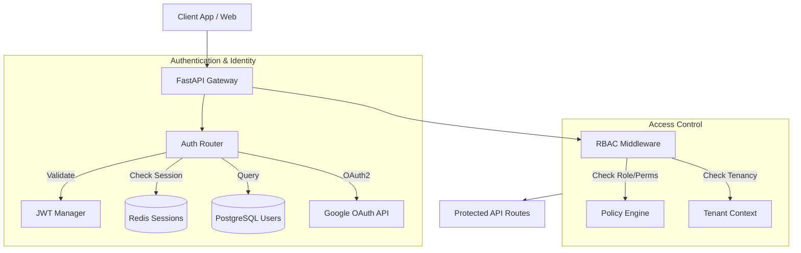
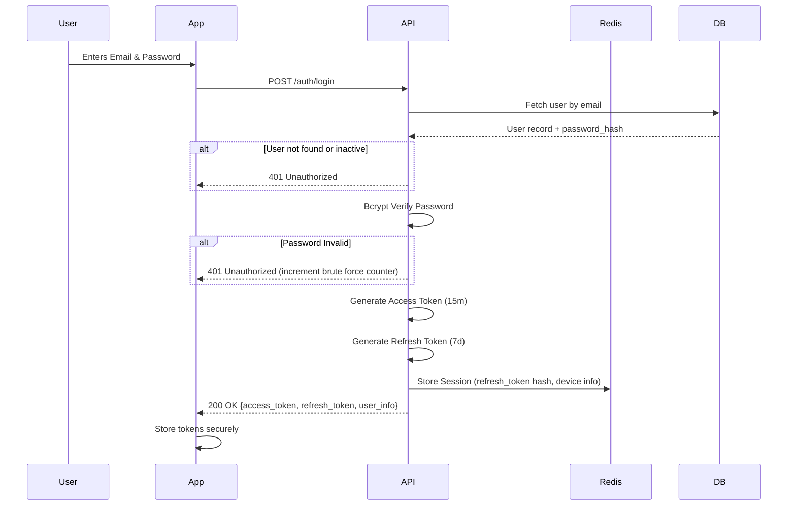

# Authentication & Authorization Flow

## 1. Authentication Architecture Overview



## 2. Registration Flow

The platform supports multiple onboarding paths depending on the user's role:

*   **Citizen:**
    *   **Standard:** Email + Password. Email verification required via OTP/Link before full access is granted.
    *   **Phone OTP:** Mobile number + SMS OTP via external provider (e.g., Twilio/Msg91). Preferred for rapid onboarding during emergencies.
    *   **OAuth2:** Google Sign-In for seamless creation.
*   **Government Officer:**
    *   Accounts cannot be self-registered. They are provisioned by an Admin.
    *   Requires a verified `.gov` email address.
    *   Officers receive a setup link to define their password and MFA settings.
*   **Admin:**
    *   A primary super-admin is created during system seeding.
    *   Can invite other admins.

## 3. Login Flow



## 4. JWT Token Structure

Tokens are signed using `HS256` (or `RS256` if separated identity provider) and contain essential claims to minimize database lookups during request validation.

**Header:**
```json
{
  "alg": "HS256",
  "typ": "JWT"
}
```

**Payload (Access Token):**
```json
{
  "sub": "user-uuid-1234",
  "email": "user@example.com",
  "role": "gov_officer",
  "city_id": "city-uuid-5678", // For multi-tenant data isolation
  "permissions": ["view:dashboard", "manage:shelters", "issue:alerts"],
  "iat": 1698765432,
  "exp": 1698766332 // +15 mins
}
```

## 5. Token Refresh Mechanism

1.  When the Access Token expires, the client sends the Refresh Token to `POST /auth/refresh`.
2.  The API validates the Refresh Token signature.
3.  The API checks Redis to ensure the session exists and has not been revoked.
4.  If valid, a new Access Token (and optionally a rotated Refresh Token) is issued.
5.  If compromised or expired, the user is forced to re-authenticate.

## 6. Role-Based Access Control (RBAC)

The system uses a hierarchical role model combined with granular permissions.

### Roles
*   `citizen`: Basic access. Can view public data, submit reports, get routing.
*   `gov_officer`: Operational access. Can verify reports, manage shelters, issue alerts, view dashboards. Restricted to their assigned `city_id`.
*   `admin`: System-wide access. Manage users, configure AI models, system health.

### Permissions Matrix Example

| Resource | Action | Citizen | Gov Officer | Admin |
| :--- | :--- | :---: | :---: | :---: |
| `reports` | `create` | ✅ | ✅ | ✅ |
| `reports` | `verify` | ❌ | ✅ (own city) | ✅ |
| `shelters` | `update` | ❌ | ✅ (own city) | ✅ |
| `alerts` | `issue` | ❌ | ✅ (own city) | ✅ |
| `users` | `manage` | ❌ | ❌ | ✅ |
| `risk_scores`| `view` | ✅ | ✅ | ✅ |

### Resource-Level Permissions
Permissions are not just boolean; they are context-aware. A `gov_officer` checking the `GET /dashboard/overview?city_id=X` endpoint will have their token's `city_id` claim checked against the requested `city_id`.

## 7. Middleware Chain

FastAPI handles requests through a specific middleware sequence:

1.  **CORS Middleware:** Validates origins.
2.  **Rate Limiter Middleware:** Checks IP/User against Redis counters.
3.  **Authentication Middleware:** Extracts Bearer token, validates signature/expiry, and attaches the `user` object to the request state (`request.state.user`).
4.  **Authorization (RBAC) Dependency:** Endpoint-level FastAPI `Depends()` checks if the user's role/permissions allow the specific action.

## 8. Password Security

*   Passwords hashed using `bcrypt` (work factor 12+).
*   Complexity rules enforced on registration (min 8 chars, mixed case, numbers, symbols).
*   Passwords are never logged or exposed in error messages.

## 9. Session Management

*   Backed by Redis.
*   **Device Tracking:** Each login records the User-Agent and IP address. Users can view active sessions in their profile and revoke them remotely.
*   **Concurrent Limits:** Citizens are limited to 3 concurrent active sessions. Officers/Admins are limited to 1 or 2 for strict control.

## 10. Security Measures

*   **Brute Force Protection:** Redis tracks failed login attempts by IP and Email. After 5 failures, the account/IP is locked for 15 minutes.
*   **Suspicious Login Detection:** If a login occurs from a new IP or geographical location (if IP geolocation is active), an email alert is sent to the user.
*   **HTTPS Only:** Tokens are only transmitted over TLS 1.3.

## 11. Logout and Token Revocation

*   **Logout:** Client calls `POST /auth/logout`, which deletes the session hash in Redis. The client discards the tokens.
*   **Revocation:** Admins or the user can revoke specific sessions or all sessions (e.g., on password reset), instantly invalidating the refresh tokens. Short-lived access tokens remain valid until expiry (max 15 mins).

## 12. API Key Authentication

For external integrations (e.g., IoT weather stations sending telemetry, or third-party mapping services):
*   Static, long-lived API Keys are generated via the Admin dashboard.
*   Passed via `X-API-Key` header.
*   Bound to specific scopes/endpoints (e.g., `write:weather_data` only).

## 13. Multi-City Tenant Isolation

FloodGuard AI is designed for multi-city deployment.
*   Every significant resource (`flood_zones`, `shelters`, `reports`) is tied to a `city_id`.
*   The `gov_officer` token payload contains their assigned `city_id`.
*   Database queries globally apply a filter (e.g., `where city_id = token.city_id`) for officer operations, ensuring data from City A cannot be mutated or viewed by officials from City B. Admins bypass this filter.
