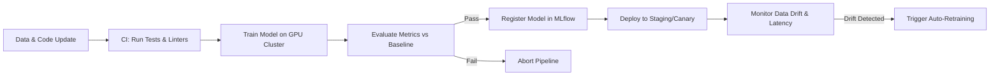

# FloodGuard AI: Complete AI & Machine Learning Pipeline

This document details the complete Artificial Intelligence and Machine Learning architecture for the FloodGuard AI platform. The system is designed to operate at a multi-city scale, processing multi-modal data streams in real-time to provide actionable intelligence for urban flood management.

## 1. AI Architecture Overview

The FloodGuard AI platform employs an ensemble of state-of-the-art models for risk scoring, prediction, computer vision, and natural language processing.

```mermaid
graph TD
    %% Data Sources
    subgraph Data Sources
        Weather[Weather APIs] --> Ingestion
        Sensors[IoT Sensors] --> Ingestion
        Crowd[Crowd Reports] --> Ingestion
        Sat[Satellite Imagery] --> Ingestion
    end

    %% Ingestion & Processing
    Ingestion[Data Ingestion Layer] --> FeatureStore[(Redis + PostgreSQL)]
    FeatureStore --> Pipeline Orchestrator

    %% Model Pipeline
    subgraph AI/ML Models
        Pipeline[Feature Engineering]
        Pipeline --> M1[M1: XGBoost Risk Engine]
        Pipeline --> M2[M2: TFT Flood Prediction]
        Pipeline --> M3[M3: GNN Evacuation Router]
        Pipeline --> M6[M6: Shelter Recommender]

        Images[Image Streams] --> M4[M4: YOLOv11 + BLIP-2 Vision]
        Audio[Audio Streams] --> M5[M5: Whisper + NLU Voice]
    end

    %% Serving
    M1 --> ModelServing[AWS SageMaker / FastAPI]
    M2 --> ModelServing
    M3 --> ModelServing
    M4 --> ModelServing
    M5 --> ModelServing
    M6 --> ModelServing

    %% Output
    ModelServing --> Client[Client Applications]
```

---

## 2. Model 1: Flood Risk Scoring Engine

The Flood Risk Scoring Engine is the core component for assessing the vulnerability of different urban zones to flooding in real-time.

- **Algorithm**: XGBoost Ensemble
- **Input Features**:
  - **Static**: Elevation, slope, drainage density, soil permeability, distance to water bodies, urbanization index.
  - **Dynamic**: Historical flood frequency, rainfall (current + forecast), tide levels.
- **Feature Engineering Pipeline**:
  - Missing value imputation via spatial interpolation.
  - Temporal aggregations of rainfall (1h, 3h, 24h).
  - Categorical encoding of soil types and land use.
- **Output**:
  - Risk Score: `0-100` continuous variable.
  - Risk Category: Very Low, Low, Medium, High, Critical.
- **Training Data**: 10+ years of historical flood records, terrain DEMs, and weather archives from IMD.
- **Training Pipeline**:
  - Data Collection → Cleaning → Feature Engineering → Temporal Train/Val/Test Split → Hyperparameter Tuning (Optuna) → Evaluation → Model Registry.
- **Metrics**:
  - Regression: RMSE, MAE.
  - Classification: AUC-ROC, Precision-Recall AUC (due to class imbalance).
- **Retraining Schedule**: Monthly, and actively triggered after every major flood event.

---

## 3. Model 2: Street-level Flood Prediction

This model predicts future water levels at specific street segments or sensor locations.

- **Architecture**: Temporal Fusion Transformer (TFT) with multi-horizon forecasting (pytorch-forecasting).
- **Input Features**:
  - **Time Series**: Rainfall intensity, water levels, tide data, upstream flow rates, soil moisture.
  - **Static**: Elevation, drainage capacity, land use type.
  - **Temporal Constraints**: Hour of day, day of year, monsoon phase.
- **Output**: Predicted water level at `1h`, `6h`, `24h`, `72h` horizons with 10th, 50th, and 90th percentile confidence intervals.
- **Training**: PyTorch Lightning utilizing distributed training across multi-GPU instances.
- **Metrics**: Mean Absolute Error (MAE), Root Mean Square Error (RMSE), Quantile Loss, Coverage Probability.

---

## 4. Model 3: Evacuation Route Optimization

Calculates the safest and most efficient evacuation routes dynamically, avoiding flooded areas.

- **Architecture**: Graph Neural Network (GNN) using PyTorch Geometric on the urban road network.
- **Graph Representation**:
  - **Nodes**: Intersections (Features: elevation, intersection type, flood risk).
  - **Edges**: Road segments (Features: road width, surface type, elevation, real-time flood depth, traffic density).
- **Algorithm**: Modified A* Search with GNN-learned edge weights that dynamically penalize flooded or highly congested segments.
- **Output**: Optimal route polyline, Estimated Time of Arrival (ETA), and risk assessment per route segment.
- **Real-time Updates**: WebSocket-fed flood depth updates instantly trigger re-weighting of graph edges to recalculate routes on the fly.

---

## 5. Model 4: Image Analysis Pipeline

Processes crowdsourced images and CCTV feeds to detect flooding and infrastructure damage.

- **Architecture**: Two-stage pipeline (YOLOv11 + Salesforce BLIP-2).
- **Stage 1 (YOLOv11)**: Object detection. Detects water bodies, stranded vehicles, people, debris, and damaged infrastructure.
- **Stage 2 (BLIP-2)**: Visual Question Answering & Captioning. Generates natural language descriptions of the flood scene and estimates severity.
- **Combined Output JSON**:
  ```json
  {
    "detected_objects": [{"class": "person", "confidence": 0.92, "bbox": [...]}, ...],
    "scene_description": "A flooded street with a stranded red car and water reaching the doors.",
    "severity_level": "High",
    "water_depth_estimate": "0.5 meters"
  }
  ```
- **Training**: Fine-tuned on the FloodNet dataset and augmented with custom Vizag flood images.
- **Inference Pipeline**: Image → Preprocessing/Resizing → YOLOv11 → BLIP-2 → Post-processing NMS → JSON Output.

---

## 6. Model 5: Voice Assistant for Emergency Response

Enables hands-free, voice-activated interaction for users in distress or seeking information.

- **Speech-to-Text (STT)**: OpenAI Whisper (large-v3), fine-tuned for robust recognition of regional Telugu and Hindi accents.
- **Natural Language Understanding (NLU)**:
  - Intent Classification: `flood_query`, `route_request`, `shelter_query`, `report_flood`, `emergency`.
  - Entity Extraction: Location, severity, resource needed.
- **Response Generation**: Hybrid approach using template-based responses for speed, falling back to a lightweight LLM for complex, conversational queries.
- **Text-to-Speech (TTS)**: Edge TTS / Google TTS.
- **Pipeline**: Audio Stream → Whisper → Intent Classifier → Action Handler (API Calls) → Response Generator → TTS.
- **Latency Target**: `< 3 seconds` end-to-end processing time.

---

## 7. Model 6: Shelter Recommendation

Intelligently matches users to the most appropriate relief shelters.

- **Algorithm**: Multi-criteria weighted scoring system.
- **Input Features**: User location, special needs (medical, disabled), family size, pet ownership.
- **Output**: Ranked list of top 3 shelters with matching scores, capacity availability, and safe routes.
- **Scoring Factors**: Distance, current capacity, accessibility, amenities match, and route safety score (derived from Model 3).

---

## 8. Data Pipeline Architecture

- **Data Ingestion**:
  - Weather APIs (IMD/OpenWeather): Polled every 15 mins.
  - IoT Sensors (Water level, flow): Pushed every 5 mins.
  - Crowd Reports: Ingested in real-time via REST/WebSockets.
  - Satellite Imagery: Fetched daily.
- **Feature Store**: Redis for ultra-fast serving of real-time features; PostgreSQL for historical batch features.
- **Data Validation**: Great Expectations suites run on incoming data to ensure schema compliance and detect anomalies (e.g., negative rainfall).
- **Pipeline Orchestration**: Celery Beat for scheduling cron jobs, with Celery workers processing the DAGs.

---

## 9. Model Serving Architecture

- **Serving Options**:
  - MVP/Dev: FastAPI with embedded PyTorch models.
  - Production: AWS SageMaker Endpoints for scalable, managed hosting.
- **Model Registry**: MLflow tracks experiments, artifacts, and model versions.
- **Deployment Strategies**:
  - A/B Testing framework for comparing model performance in the wild.
  - Model versioning with instant rollback capabilities.
  - Canary deployments (10% traffic) for new model iterations.

---

## 10. MLOps Pipeline



---

## 11. Ethical AI & Fairness

- **Bias Detection**: Continuous monitoring of predictions across demographic neighborhoods to ensure low-income or marginalized areas are not systematically under-prioritized in risk scoring or routing.
- **Explainability**: Integration of SHAP (SHapley Additive exPlanations) values to provide transparency on why a specific risk score was assigned (e.g., "Score is high primarily due to drainage blockage and high rainfall").
- **Human-in-the-Loop**: All automated severity assessments from crowd reports are queued for random manual verification to maintain quality.
- **Fairness Metrics**: Disparate impact analysis performed quarterly.

---

## 12. Fallback Strategies (High Availability)

When AI models are unavailable (e.g., inference endpoint failure or extreme latency):

- **Risk Scoring**: Reverts to rule-based heuristics (Base Elevation + Cumulative 24h Rainfall threshold).
- **Predictions**: Employs persistence forecasting (Current Level + Linear Trend of last hour).
- **Image Analysis**: Bypasses AI; routes all images directly to a priority manual review queue.
- **Voice Assistant**: Reverts to a structured text-based interface or IVR menu system.
