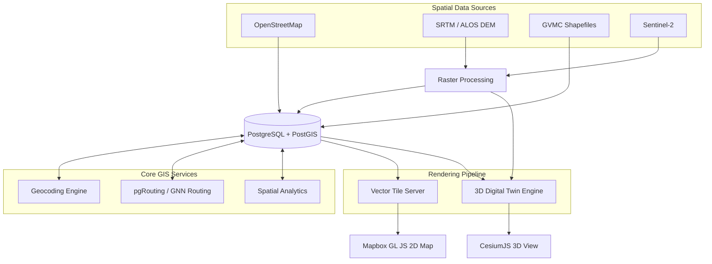

# FloodGuard AI: Geospatial & GIS Pipeline

This document details the Geographic Information Systems (GIS) and spatial data processing pipeline that powers the mapping, routing, and location-based intelligence of the FloodGuard AI platform.

## 1. GIS Architecture Overview



---

## 2. Spatial Data Sources

FloodGuard AI relies on a rich, multi-layered spatial dataset to provide accurate context:

*   **OpenStreetMap (OSM)**: Ingested via Overpass API for road networks, building footprints, and Points of Interest (POIs).
*   **SRTM/ALOS DEM**: 30-meter resolution Digital Elevation Models used to calculate slopes, sinks, and baseline elevations.
*   **Sentinel-2 Imagery**: Used periodically to detect broad land-use changes and large-scale water body extents.
*   **GVMC Official Data**: Municipal shapefiles for ward boundaries, administrative zones, and critical infrastructure.
*   **IMD Stations**: Static point coordinates for weather monitoring stations.
*   **Drainage Network**: Underground and surface drainage polyline data mapped by municipal authorities.

---

## 3. PostGIS Spatial Database

The core storage engine for all vector data is PostgreSQL enhanced with the PostGIS extension.

*   **Geometry Types Used**:
    *   `Point`: User locations, IoT sensors, shelter locations, weather stations.
    *   `LineString`: Evacuation routes, drainage networks, road segments.
    *   `Polygon`: Flood inundation extents, ward boundaries, building footprints.
    *   `MultiPolygon`: Complex city and district boundaries.
*   **Coordinate Reference Systems (SRID)**:
    *   `4326` (WGS 84): Standard storage format for web compatibility (Lat/Lon).
    *   `32644` (UTM Zone 44N): Projected CRS used for accurate metric distance and area calculations specifically for the Visakhapatnam region.
*   **Indexing**: `GiST` (Generalized Search Tree) indexes applied to all geometry columns for optimized bounding box searches.
*   **Common Spatial Queries**:
    *   `ST_Within` / `ST_Contains`: Determining which ward a reported incident falls into.
    *   `ST_DWithin`: Finding all shelters within 5km of a user.
    *   `ST_Intersects`: Finding roads crossing a flood polygon.
    *   `ST_Buffer`: Creating impact zones around a hazard.

---

## 4. Map Rendering Pipeline (2D)

Provides the primary interactive interface for web and mobile clients.

*   **Engine**: Mapbox GL JS.
*   **Tile Delivery**: Combination of Mapbox-hosted base maps and a custom vector tile server (e.g., Tegola or Martin) for dynamic flood overlays.
*   **Layer Architecture**:
    *   `Z-Index 0`: Base Layer (Mapbox Streets or Dark style for contrast).
    *   `Z-Index 1`: Ward Boundaries.
    *   `Z-Index 2`: Weather Radar Overlay (raster tiles).
    *   `Z-Index 3`: Flood Risk Heatmap (Dynamic polygons, colors mapped to AI risk scores).
    *   `Z-Index 4`: Evacuation Routes (LineStrings with animated directional arrows).
    *   `Z-Index 5`: Shelter Markers (Color-coded: Green=Available, Red=Full).
    *   `Z-Index 6`: Crowd Report Markers (Clustered using Supercluster at zoom levels < 14).
*   **Dynamic Styling**: Data-driven styling allows real-time color and size updates based on WebSocket state changes without reloading the map.
*   **Performance**: Debounced rendering, viewport-based data fetching (bounding box queries), and strict layer visibility zoom thresholds.

---

## 5. 3D Digital Twin Pipeline

Advanced visualization for command center operators to assess physical impact.

*   **Engine**: CesiumJS (for globe/terrain context) integrated with Three.js (for custom physics and water simulation).
*   **Data Pipeline**:
    *   DEM converted to quantized-mesh terrain tiles for Cesium.
    *   OSM Building footprints extruded into 3D models based on height attributes.
*   **Flood Simulation**: Water levels are rendered as dynamic, semi-transparent blue planes intersecting the 3D terrain and buildings, animated temporally.
*   **Optimization**: Frustum culling (not rendering off-screen objects), LOD (Level of Detail) scaling, and instanced rendering for repetitive building geometry.
*   **Interaction**: Raycasting for building selection/metadata, and a time-slider UI to scrub through TFT model flood predictions (1h, 6h, 24h).

---

## 6. Geocoding & Reverse Geocoding

Translating between human-readable addresses and spatial coordinates.

*   **Primary Engine**: Mapbox Geocoding API.
*   **Reverse Geocoding**: Automatically converts the GPS coordinates of a crowd-sourced image/report into a localized address string (e.g., "Near MVP Colony Sector 3").
*   **Local Fallback**: PostGIS-based offline geocoding using `ST_Distance` against a materialized view of known landmarks and street names, ensuring functionality during internet outages.

---

## 7. Routing Engine

*   **Graph Processing**: OSM road network parsed into topological nodes and edges.
*   **Storage**: PostgreSQL adjacency list format compatible with `pgRouting`. Alternatively, pushed to an in-memory graph (NetworkX) for the GNN AI model.
*   **Dynamic Impedance (Flood-Aware)**: The cost (weight) of traversing an edge is dynamically updated. Base cost = distance/speed limit. Penalty multipliers are applied based on real-time flood depth (e.g., >30cm water = infinite cost / impassable).
*   **Multi-modal**: Separate routing profiles for driving (avoids small paths), walking (allows pedestrian paths, avoids highways), and wheelchair-accessible routes (avoids stairs/steep slopes).

---

## 8. Spatial Analytics

Background geo-processing tasks.

*   **Flood Extent Estimation**: Interpolating discrete point measurements (IoT sensors) into continuous polygon boundaries defining the flood edge.
*   **Watershed Analysis**: Calculating the upstream catchment area to determine how rainfall far away will impact specific drainage nodes.
*   **Exposure Analysis**: `ST_Intersects` join of predicted flood polygons with building footprints and census population data to estimate human impact.
*   **Hotspot Analysis**: Kernel Density Estimation (KDE) applied to emergency SOS reports to identify critical rescue zones.

---

## 9. GeoJSON Specifications

All REST API endpoints exchanging spatial data adhere strictly to the GeoJSON standard (RFC 7946).

*   **Standardization**: Every feature is wrapped in a `FeatureCollection`.
*   **Properties**: Rich metadata embedded in the `properties` object.
*   **Precision**: Coordinates truncated to 6 decimal places (approx 11cm accuracy) to reduce payload size.
*   **Ordering**: `[longitude, latitude]` strict compliance.

```json
{
  "type": "Feature",
  "geometry": {
    "type": "Point",
    "coordinates": [83.3186, 17.7290]
  },
  "properties": {
    "id": "sh_104",
    "type": "shelter",
    "capacity_current": 120,
    "capacity_max": 500
  }
}
```

---

## 10. Performance Optimization

*   **Spatial Indexing**: Routine `VACUUM ANALYZE` and re-indexing of GiST indexes.
*   **Tile Caching**: Raster and vector tiles are cached in Redis and served via CloudFront CDN.
*   **Viewport Loading**: Client applications ALWAYS pass `bbox` (bounding box) parameters to API endpoints to limit data retrieval to the visible screen area.
*   **Geometry Simplification**: Use of `ST_SimplifyPreserveTopology` to reduce the number of vertices in complex polygons (like city wards) when viewed at high zoom levels (zoomed out).
*   **Delta Updates**: WebSockets push only attribute changes (e.g., `{"id": "road_1", "status": "flooded"}`) rather than resending geometry.
