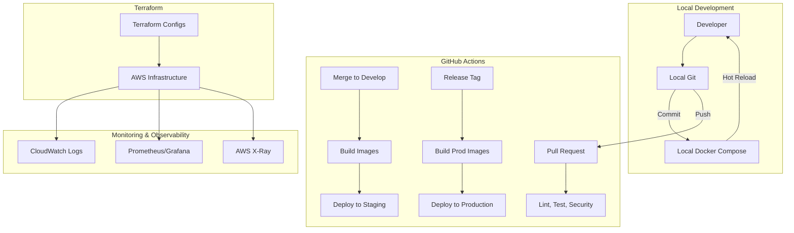
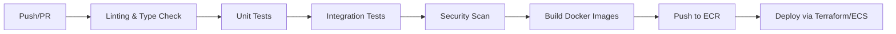

# DevOps Architecture

This document outlines the DevOps architecture, CI/CD pipelines, containerization strategy, and observability practices for the FloodGuard AI platform.

## 1. DevOps Overview

The DevOps lifecycle is designed to enable rapid iteration during the MVP phase while ensuring high reliability and security for production deployments.

## 2. Local Development Environment

We provide a comprehensive local development environment using Docker Compose to ensure consistency between development and production.

### Docker Compose Stack

- **Frontend**: React Vite with HMR (Hot Module Replacement)
- **Backend**: FastAPI Python with uvicorn auto-reload
- **Database**: PostgreSQL with PostGIS extension for spatial queries
- **Cache/Broker**: Redis
- **Workers**: Celery worker and Celery beat for background tasks
- **Monitoring**: Flower (Celery dashboard)
- **Storage**: MinIO (S3-compatible object storage for local dev)

### Features

- **Hot-reload**: Enabled for both frontend and backend to accelerate development.
- **Seed Data Scripts**: Python scripts to populate the database with realistic test data (weather, sensors, mock users).
- **Configuration**: Uses `.env.development` which overrides base settings.

## 3. CI/CD Pipeline (GitHub Actions)

Our continuous integration and continuous deployment pipelines are orchestrated using GitHub Actions.

### Workflows

1. **Workflow 1: PR Checks**: Runs on every pull request. Performs linting (Ruff, ESLint), type-checking (MyPy, tsc), and basic security scanning (Bandit).
2. **Workflow 2: Backend CI**: Runs `pytest` suite, generates coverage reports, and fails if coverage drops below 80%.
3. **Workflow 3: Frontend CI**: Runs `vitest` suite, TypeScript compilation checks, and builds the production bundle to ensure no build errors.
4. **Workflow 4: Integration Tests**: Spins up a lightweight `docker-compose` environment in CI to run API and E2E tests against a real database.
5. **Workflow 5: Deploy to Staging**: Triggered automatically on merge to the `develop` branch.
6. **Workflow 6: Deploy to Production**: Triggered manually on creating a new release tag (e.g., `v1.0.0`) from the `main` branch.
7. **Workflow 7: ML Model CI**: Validates new model weights, runs inference tests on validation datasets, and checks latency requirements.

### Branch Strategy

- `main`: Production-ready code (deployed to Prod).
- `develop`: Integration branch (deployed to Staging).
- `feature/*`: Active development branches (run PR checks).

## 4. Container Architecture

### Multi-stage Dockerfiles

We use multi-stage builds to keep final images small and secure.

- **Builder Stage**: Installs all build dependencies (e.g., `gcc`, `build-essential`), compiles requirements, builds wheels.
- **Production Stage**: Uses a slim base image (e.g., `python:3.11-slim`), copies only compiled artifacts and source code. No build tools are present.

### Image Optimization

- Layer caching optimized by copying `requirements.txt` / `package.json` before source code.
- Minimal base images to reduce attack surface.

### Registry

- AWS Elastic Container Registry (ECR) for hosting production images with immutable tags (git SHA).

## 5. Infrastructure as Code (Terraform)

All AWS infrastructure is provisioned using Terraform, ensuring reproducible environments.

### Terraform Modules

- **VPC Module**: Networking, public/private subnets, NAT gateways.
- **ECS Module**: Fargate clusters, task definitions, services.
- **RDS Module**: PostgreSQL multi-AZ deployments.
- **ElastiCache Module**: Redis clusters.
- **S3 & CloudFront**: Buckets and CDN distributions.
- **ALB Module**: Application Load Balancers and target groups.
- **IAM Module**: Roles and policies following least privilege.

### State Management

- Terraform state is stored securely in an **S3 backend** with versioning enabled.
- State locking is managed via **DynamoDB** to prevent concurrent modifications.

### Environment Management

Separate `tfvars` files (`dev.tfvars`, `staging.tfvars`, `prod.tfvars`) manage environment-specific sizing and configurations.

## 6. Monitoring & Observability

### Stack

- **Metrics**: CloudWatch Metrics + Prometheus (custom app metrics) + Grafana Dashboards.
- **Logging**: Structured JSON logging in Python/Node.js, shipped to CloudWatch Logs.
- **Tracing**: AWS X-Ray for distributed tracing across microservices and AWS resources.

### Alerting

- **CloudWatch Alarms**: Configured for high CPU/Memory, 5xx error spikes, database connection exhaustion.
- **SNS Topics**: Route alerts to PagerDuty (critical) and Slack (warnings/info).

### Dashboards

- **System Health**: CPU, memory, network I/O.
- **API Performance**: P95/P99 latency, request rates, error rates.
- **AI Model Performance**: Inference times, queue depths for SageMaker/Celery.

### Uptime

- Synthetic checks (Datadog/AWS CloudWatch Synthetics) testing critical user journeys every minute.

## 7. Secret Management

- **Production**: AWS Secrets Manager stores database credentials, API keys, and JWT secrets. ECS tasks pull these securely at runtime.
- **CI/CD**: GitHub Secrets for deployment credentials (AWS Access Keys, scoped roles).
- **Local Dev**: `.env` files (strictly ignored in `.gitignore`).
- **Rotation**: RDS passwords and key API secrets are rotated automatically every 90 days via AWS Lambda.
