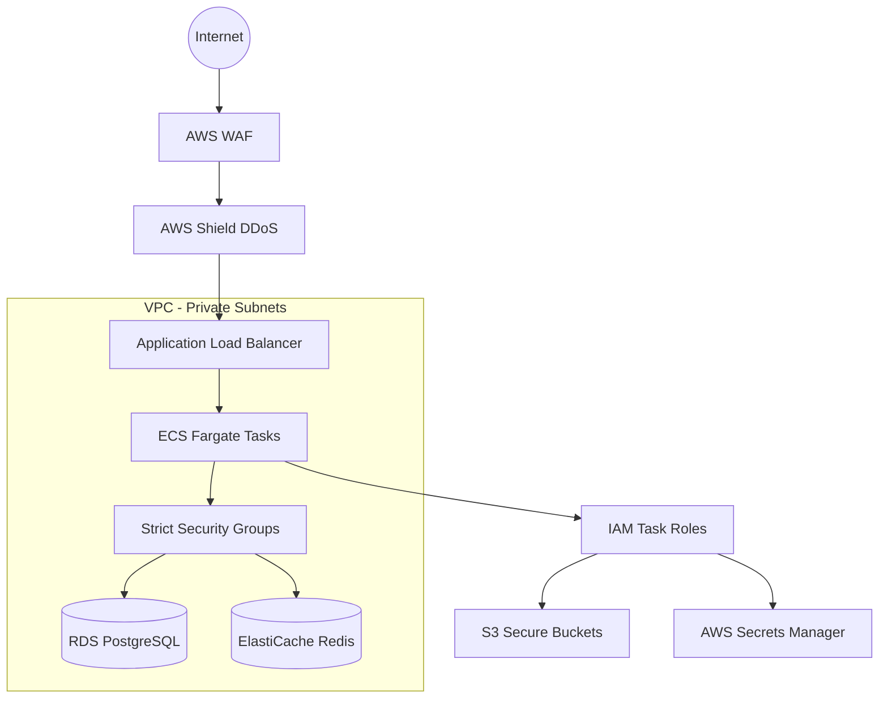

# Security Strategy

This document details the security architecture, threat mitigations, and compliance measures for the FloodGuard AI platform.

## 1. Security Architecture Overview

## 2. Threat Model (STRIDE)

- **Spoofing**: Mitigated via strong JWT authentication and MFA for sensitive roles.
- **Tampering**: TLS 1.3 in transit, AES-256 encryption at rest. Strict Pydantic input validation.
- **Repudiation**: Comprehensive audit logging of all system state changes.
- **Information Disclosure**: Strict IAM roles, VPC private subnets, no public IP assignments to databases.
- **Denial of Service**: AWS Shield Standard, API rate limiting, ALB timeouts.
- **Elevation of Privilege**: Role-Based Access Control (RBAC) enforced at the API route level.

## 3. Network Security

- **VPC Isolation**: All compute (ECS) and data (RDS, Redis) resources reside in private subnets with no direct internet access. Outbound traffic routes through NAT Gateways.
- **Security Groups**: Follow least-privilege. RDS only accepts traffic from ECS security groups.
- **WAF**: AWS WAF deployed on the ALB using OWASP core rule sets to block SQLi, XSS, and bad bots.
- **Encryption**: TLS 1.3 enforced for all external endpoints via ACM. Internal traffic within VPC is also encrypted.

## 4. Application Security (OWASP Top 10)

| Risk | Mitigation Strategy | Implementation |
|------|---------------------|----------------|
| Broken Access Control | Default deny, explicit route decorators | FastAPI Depends(verify_role) |
| Cryptographic Failures | Strong defaults, no custom crypto | bcrypt, AES-256, TLS 1.3 |
| Injection | ORM usage, strict validation | SQLAlchemy, Pydantic schemas |
| Insecure Design | Threat modeling, secure defaults | Architecture reviews |
| Security Misconfiguration| IaC, automated audits | Terraform, AWS Security Hub |

- **XSS & CSRF**: Handled by React frontend encoding and strict CORS/CSP headers. CSRF tokens for state-changing endpoints if cookies are used.
- **Rate Limiting**: Applied per IP and per user role using Redis to prevent abuse.

## 5. Authentication Security

- **Password Policy**: Minimum 12 characters, complexity requirements, hashed using `bcrypt` with appropriate work factor.
- **JWT**: RS256 asymmetric signing. Short-lived access tokens (15 mins), securely stored HTTP-only refresh tokens.
- **MFA**: Mandatory Time-based One-Time Password (TOTP) for government and admin accounts.
- **Brute Force**: Account lockout mechanism after 5 failed attempts (tracked in Redis).

## 6. Data Security

- **At Rest**: RDS encrypted using AWS KMS (AES-256). S3 buckets enforce SSE-S3 encryption.
- **PII Handling**: User locations, names, and contact details are minimized. Pseudonymization used for analytics datasets.
- **Data Classification**: Clear boundaries between Public (weather data), Internal, Confidential (user data), and Restricted (government infrastructure details).

## 7. API Security

- **External Consumers**: Governed by API keys with strict usage quotas and IP whitelisting.
- **Webhooks**: Outbound webhooks signed with HMAC; inbound webhooks verified cryptographically.
- **Payload Limits**: Max body size configured at the ALB and FastAPI levels to prevent memory exhaustion.

## 8. File Upload Security

- **Validation**: Verifies files via "magic bytes" (python-magic), not just extensions.
- **Limits**: Max 10MB for images, 50MB for documents.
- **Scanning**: Uploads hit an isolated S3 quarantine bucket, trigger a ClamAV Lambda scan, and are moved to the main bucket only if clean.
- **Delivery**: Files served with strict `Content-Disposition` and `Content-Security-Policy` headers.

## 9. Monitoring & Incident Response

- **Logging**: Failed authentications, privilege escalations, and sensitive data access are logged securely.
- **SIEM**: Logs shipped to centralized logging (CloudWatch/Splunk) for anomaly detection.
- **Incident Response**: Playbooks defined for data breaches, service degradation, and unauthorized access.

## 10. Compliance

- **India IT Act 2000 / DPDP Act 2023**: Platform designed with privacy-by-design principles, explicit user consent mechanisms, and right-to-be-forgotten flows.
- **Data Residency**: All infrastructure deployed exclusively in the `ap-south-1` (Mumbai) region.
- **NDMA**: Aligned with National Disaster Management Authority data sharing guidelines.

## 11. Security Testing

- **SAST**: Bandit (Python) and ESLint security plugins run on every PR.
- **DAST**: OWASP ZAP integrated into the deployment pipeline for staging environments.
- **Dependencies**: Dependabot and `pip-audit` monitor for CVEs in third-party libraries.
- **Pen Testing**: Scheduled quarterly third-party penetration testing.
