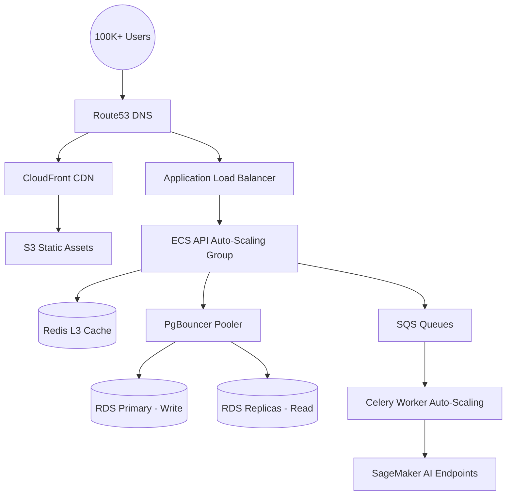

# Scalability Plan

This document outlines the architecture and strategies for scaling the FloodGuard AI platform to support 100K+ concurrent users across multiple cities.

## 1. Scalability Architecture

## 2. Current Scale Targets

- **Normal Operations**: ~10,000 concurrent users.
- **Monsoon Season**: ~50,000 concurrent users.
- **Active Flood Event**: 100,000+ concurrent users.
- **Data Volume**: 10M+ records, 100GB+ spatial data (PostGIS), 1TB+ image assets.
- **Geographic Scope**: 10+ major cities in India.

## 3. Horizontal Scaling

- **Stateless Backend**: The FastAPI backend is strictly stateless. Session state is stored in Redis. This allows ECS Fargate tasks to scale out instantly based on CPU/Memory metrics.
- **Worker Scaling**: Celery workers scale horizontally based on the depth of the SQS/Redis queues.
- **Load Balancing**: AWS ALB distributes traffic across healthy container instances.

## 4. Database Scaling

- **Read/Write Splitting**: Heavy read traffic (dashboards, public map data) is routed to RDS Read Replicas. The primary instance handles only writes.
- **Connection Pooling**: `PgBouncer` is deployed to manage database connections, preventing connection exhaustion during rapid scaling of API tasks.
- **Partitioning**: Large tables (`weather_data`, `predictions`, `audit_logs`) are partitioned by time (monthly/weekly).
- **Materialized Views**: Complex spatial queries and dashboard aggregations are pre-calculated into materialized views that refresh concurrently on a schedule.

## 5. Caching Strategy (Multi-Layer)

- **L1 (Client/Browser)**: Static assets and SPA bundles cached aggressively via `Cache-Control` headers (1 year TTL).
- **L2 (CDN)**: Public API responses (e.g., general city flood risk) cached at the CloudFront edge nodes (5-minute TTL).
- **L3 (Application/Redis)**: 
  - Risk scores: 5 min TTL
  - Weather forecasts: 15 min TTL
  - Shelter lists: 1 min TTL
  - User sessions: 24h TTL
- **Cache Warming**: Critical caches are pre-warmed via scripts immediately following a deployment or a major data update.

## 6. AI Model Scaling

- **Decoupled Architecture**: AI models are not embedded in the web API. They run as separate Celery tasks or managed SageMaker endpoints.
- **Compute Matrix**: 
  - CPU: Lightweight models (XGBoost tabular predictions).
  - GPU: Heavy models (YOLOv11 vision, BLIP-2 VQA, Whisper audio).
- **Batching**: Non-critical predictions (e.g., hourly general risk updates) use batch inference.
- **Queuing**: User-submitted reports requiring AI analysis are queued to prevent endpoint overload.

## 7. Real-time Scaling

- **WebSockets**: Handled efficiently by FastAPI, but for 100K scale, connection state is centralized via Redis Pub/Sub, allowing any API node to push events to any connected user.
- **Backpressure**: Strict connection limits and fallback to long-polling or staggered updates if WebSocket capacity maxes out during a crisis.

## 8. Multi-city Scaling (Tenant Architecture)

- **Logical Isolation**: A single shared infrastructure using `city_id` for logical partitioning in the database.
- **Data Sharding**: As we grow beyond 10 cities, large tables will be natively sharded or partitioned by `city_id` to maintain query performance.
- **Localized AI**: Different model weights loaded dynamically based on the geographic region being queried.

## 9. Performance Testing

- **Load Testing**: `Locust` scripts simulate normal traffic and flood-event spikes.
- **Chaos Engineering**: Randomly killing ECS tasks or simulating high DB latency to ensure graceful degradation.
- **CI/CD Integration**: Performance regression tests run nightly on staging.

## 10. Scaling Roadmap

- **Phase 1 (MVP)**: Single city focus, up to 10K users. Single RDS instance, 2-4 ECS tasks.
- **Phase 2 (Growth)**: Expansion to 3 cities, 50K users. Implement Read Replicas, PgBouncer, and 5-15 ECS tasks.
- **Phase 3 (Scale)**: 10+ cities, 100K+ users. Extract heavy domains into microservices, deploy dedicated SageMaker endpoints with auto-scaling, implement database sharding.
