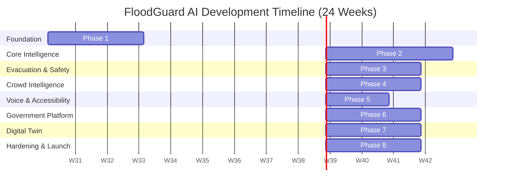

# Milestone Roadmap: FloodGuard AI

This document details the phased development roadmap for the FloodGuard AI platform, an AI-powered Flood Intelligence Platform designed for Indian smart cities (initial deployment: Visakhapatnam). The project spans 24 weeks across 8 distinct phases, taking the platform from foundation to a production-ready system capable of scaling to 100K+ concurrent users.

## 📅 Full Project Timeline

## 📍 Phases & Milestones

| Phase                        | Duration    | Key Deliverables                                                                     | Success Criteria                                                                                   | Dependencies                                       |
| ---------------------------- | ----------- | ------------------------------------------------------------------------------------ | -------------------------------------------------------------------------------------------------- | -------------------------------------------------- |
| **1: Foundation**            | Weeks 1-3   | Dev environment, PostgreSQL+PostGIS schema, JWT Auth, Base UI                        | CI/CD passing, users can register/login, role-based access working                                 | Finalized UI/UX designs                            |
| **2: Core Intelligence**     | Weeks 4-7   | Weather ingestion pipeline, XGBoost risk API, TFT prediction API, Mapbox integration | Weather data syncing daily, >85% prediction accuracy on validation set, Risk zones rendered on map | Historical weather/flood data, City zone polygons  |
| **3: Evacuation & Safety**   | Weeks 8-10  | Shelter CRUD, GNN evacuation routing, Citizen shelter finder                         | <2s routing response, shelters plotted accurately on map                                           | Road network dataset (OSM), Shelter location data  |
| **4: Crowd Intelligence**    | Weeks 11-13 | Report submission, YOLOv11/BLIP-2 analysis, Notification system                      | Images processed <5s, >80% accuracy in flood detection from images                                 | Annotated flood image dataset for fine-tuning      |
| **5: Voice & Accessibility** | Weeks 14-15 | Whisper STT + NLU, Telugu/Hindi/English support, i18n UI                             | Accurate intent extraction from voice in 3 languages, fully translated UI                          | Translation strings, Audio samples                 |
| **6: Government Platform**   | Weeks 16-18 | Gov analytics dashboard, Alert management, PDF/CSV reports                           | Dashboard loads <3s with large datasets, alerts successfully broadcasted                           | Gov reporting requirements                         |
| **7: Digital Twin**          | Weeks 19-21 | CesiumJS terrain, Three.js buildings, Time-series simulation overlay                 | Smooth 60fps rendering of 3D map, accurate water level simulation visualization                    | High-res elevation data (DEM), Building footprints |
| **8: Hardening & Launch**    | Weeks 22-24 | Security audit, Load testing (100K users), PWA, AWS Production setup                 | Zero critical vulnerabilities, P99 latency <500ms at 100K CCU, Beta deployed                       | Approved budget for AWS infrastructure             |

## 👥 Resource Requirements

| Phase       | Team Size & Skills Needed                                                 |
| ----------- | ------------------------------------------------------------------------- |
| **Phase 1** | 1 DevOps, 1 Backend, 1 Frontend                                           |
| **Phase 2** | 1 Data Scientist (ML), 1 Data Engineer, 1 Backend, 1 Frontend (GIS focus) |
| **Phase 3** | 1 ML Engineer (GNN), 1 Backend, 1 Frontend                                |
| **Phase 4** | 1 CV Engineer (YOLO), 1 Backend, 1 Frontend, 1 QA                         |
| **Phase 5** | 1 ML Engineer (NLP/Speech), 1 Frontend (i18n)                             |
| **Phase 6** | 1 Backend, 2 Frontend (Data Viz), 1 QA                                    |
| **Phase 7** | 1 3D Graphics Engineer (WebGL/Three.js), 1 GIS Specialist                 |
| **Phase 8** | 1 DevOps/SRE, 1 Security Specialist, Full Development Team                |

## ⚠️ Risk Register

| Risk                                         | Probability | Impact   | Mitigation Strategy                                                                                             |
| -------------------------------------------- | ----------- | -------- | --------------------------------------------------------------------------------------------------------------- |
| **PostGIS setup complexity**                 | Medium      | Medium   | Use official PostGIS Docker images; allocate buffer time for spatial indexing optimization.                     |
| **Model training data availability**         | High        | High     | Partner early with local authorities (GVMC); use synthetic data or transfer learning if data is sparse.         |
| **GNN training complexity**                  | Medium      | High     | Start with a simpler graph heuristic (e.g., A*) as a fallback while tuning the GNN.                             |
| **Model fine-tuning for Indian imagery**     | High        | Medium   | Curate a specific dataset of Indian street contexts; leverage pre-trained BLIP-2 to handle zero-shot scenarios. |
| **Telugu/Hindi accent recognition accuracy** | High        | High     | Fine-tune Whisper on regional datasets (e.g., AI4Bharat); implement a "confirm intent" UI flow.                 |
| **Data viz performance (gov dashboard)**     | Medium      | Medium   | Implement data aggregation/downsampling on the backend; use virtualization in frontend tables/charts.           |
| **3D rendering performance**                 | High        | High     | Implement LOD (Level of Detail); optimize building geometries; lazy-load terrain tiles.                         |
| **Performance at scale (100K users)**        | Medium      | Critical | Extensive stress testing (Locust); aggressive Redis caching; auto-scaling groups on AWS.                        |

## 🚦 Go/No-Go Criteria (Phase Gates)

At the end of each phase, a formal review will determine if the project can proceed:

1. **Phase 1 Gate:** Codebase is stable, automated tests pass, auth system is secure and verified.
2. **Phase 2 Gate:** Model accuracy meets minimum threshold (85%), map renders without lagging.
3. **Phase 3 Gate:** Routing algorithm correctly avoids flooded zones, latency is acceptable.
4. **Phase 4 Gate:** AI image pipeline correctly identifies false positives; push notifications are reliable.
5. **Phase 5 Gate:** Voice assistant successfully handles 90% of test queries in all target languages.
6. **Phase 6 Gate:** Dashboard handles maximum expected data volume without UI freezing.
7. **Phase 7 Gate:** Digital twin runs on standard hardware (integrated GPUs) without crashing.
8. **Phase 8 Gate (Launch):** Load tests pass 100K CCU requirement, security sign-off complete, GVMC approval received.
