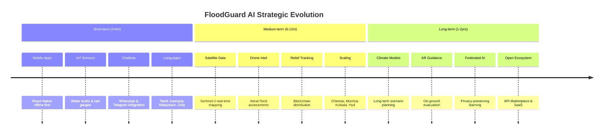
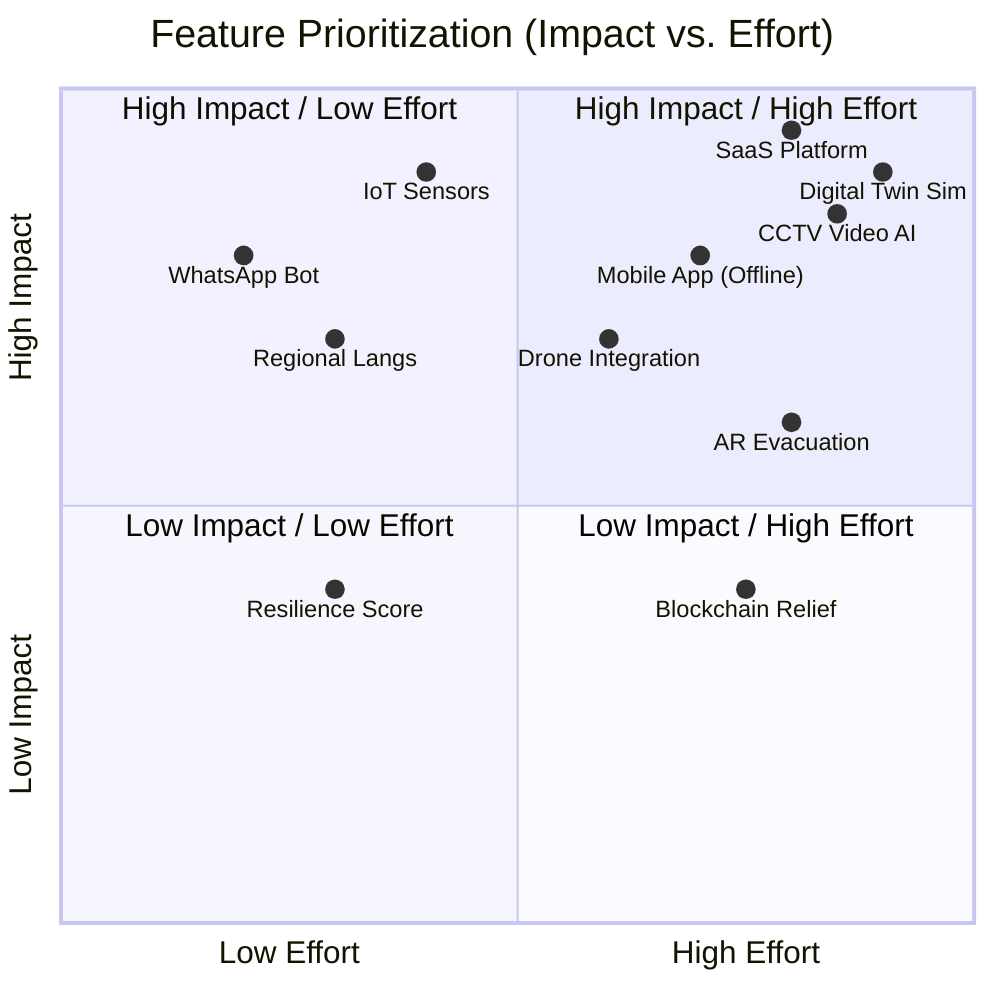

# Future Enhancements: FloodGuard AI

This document outlines the strategic vision and future enhancement roadmap for the FloodGuard AI platform beyond the initial Visakhapatnam deployment. The roadmap is categorized into short, medium, and long-term goals, alongside research opportunities and monetization strategies.

## 🗺️ Enhancement Timeline

## 1. Short-term (3-6 months post-launch)

- **Mobile Application:** React Native app for citizens and field officers with an offline-first architecture (syncs data when connection is restored).
- **IoT Sensor Integration:** Direct ingestion from municipal water level sensors, rain gauges, and smart drain monitors.
- **Conversational Interfaces:**
  - WhatsApp bot integration for automated alerts and citizen queries.
  - Telegram bot for community reporting and coordination.
- **Advanced Analytics:** Predictive maintenance models for drainage infrastructure based on historical clogging data.
- **Multi-language Expansion:** Add support for Tamil, Kannada, Malayalam, and Odia to prepare for wider deployment.

## 2. Medium-term (6-12 months)

- **Satellite Imagery Analysis:** Ingest Sentinel-2 data for near real-time, city-wide flood extent mapping.
- **Drone Integration:** Automated ingestion and photogrammetry of aerial flood assessment data.
- **AI-Powered Damage Assessment:** Computer vision models to estimate property and infrastructure damage for post-flood insurance/relief processing.
- **Blockchain-based Relief Distribution:** Transparent tracking of relief materials, funds, and compensation distribution.
- **Community Resilience Scoring:** Gamified metrics to evaluate ward-level preparedness.
- **National Integration:** API bridges to NDMA (National Disaster Management Authority) and SDMA systems.
- **Multi-city Deployment:** Scale platform to high-risk cities: Chennai, Mumbai, Kolkata, and Hyderabad.

## 3. Long-term (1-2 years)

- **Climate Change Impact Modeling:** Long-term flood risk simulations under varying IPCC climate scenarios.
- **Advanced Digital Twin:** City-scale simulation environment with complex "what-if" urban planning tools (e.g., simulating the impact of new drainage systems).
- **AR (Augmented Reality):** AR overlays via mobile app for on-ground evacuation guidance and safe route finding in low visibility.
- **Federated Learning:** Train AI models collaboratively across multiple cities without sharing sensitive private data.
- **Open API Marketplace:** Ecosystem for third-party developers, researchers, and startups to build specialized tools on top of FloodGuard data.
- **Real-time Video Analytics:** Direct integration with city CCTV networks (ICCC) for real-time automated flood detection.
- **Autonomous Drones:** Automated dispatch of drones for rescue coordination in identified high-risk clusters.

## 4. Research Opportunities

- **Foundation Models for Flood Prediction:** Exploring transfer learning techniques to deploy models in new cities with zero or few-shot learning.
- **Graph Transformer Networks:** Advanced modeling of urban flood propagation across complex drainage topologies.
- **Reinforcement Learning:** Agents trained to optimize resource allocation (boats, personnel, food) during active disasters.
- **Synthetic Data Generation:** Using GANs (Generative Adversarial Networks) to create realistic flood scenario imagery for training CV models.
- **Multimodal LLMs:** Employing vision-language models for comprehensive natural disaster situational awareness and automated briefing generation.

## 5. Platform Evolution

- **Multi-hazard Expansion:** Evolve from flood-only to a comprehensive disaster management platform covering earthquakes, cyclones, landslides, and heatwaves.
- **B2G SaaS Platform:** Standardized cloud offering tailored for municipal corporations with self-serve onboarding.
- **Open-source Community Edition:** A stripped-down core version released to the open-source community to foster global collaboration.
- **Government Marketplace:** Listing on GeM (Government e Marketplace) to streamline procurement by Indian civic bodies.

## 6. Monetization Strategy

- **B2G SaaS Licensing:** Annual recurring revenue per city based on population size and feature tiers.
- **Insurance API Access:** Paid API access for insurance companies to pull granular risk data for premium calculation and automated claims verification.
- **Real Estate Risk API:** Integrations with real estate platforms (e.g., MagicBricks, 99acres) to display property flood risk scores.
- **Consulting & Implementation:** Premium services for custom city-specific model tuning, sensor deployment, and training.
- **Grant & Institutional Funding:** Securing scale-up capital through World Bank, ADB, and UN Habitat disaster resilience grants.

## 🎯 Prioritization Matrix

