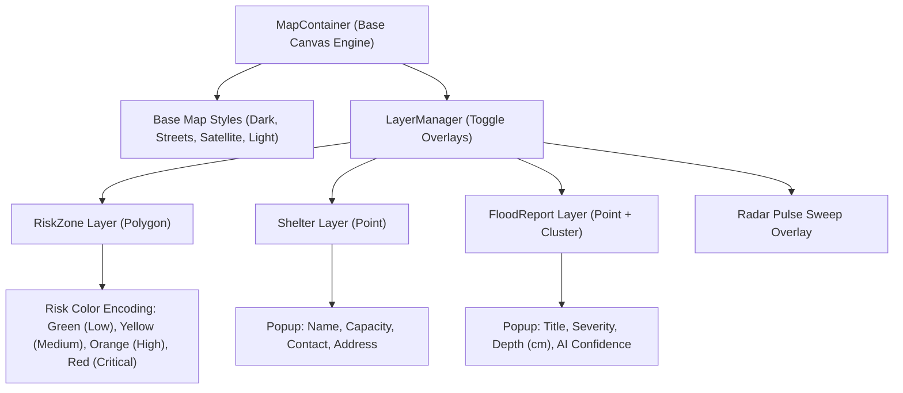

# FloodGuard AI — Milestone 6 GIS Module & Architecture Report

## 1. GIS Component Folder Structure

```
apps/web/src/components/maps/
├── map-container.tsx        # Core Mapbox vector canvas engine with style, zoom, pitch, & layer state
├── map-controls.tsx         # Navigation controls (+/- zoom, pitch reset, rotate, fullscreen, geolocation)
├── layer-manager.tsx        # Interactive toggle panel for active vector overlays
├── marker-layer.tsx         # Point marker rendering engine with clustering for flood reports
├── risk-zone-layer.tsx      # PostGIS polygon rendering with risk-encoded color scales
├── shelter-layer.tsx        # Relief shelter markers with live capacity badges
├── flood-report-layer.tsx   # Crowdsourced report markers with severity color badges
├── legend.tsx               # Floating map legend displaying risk colors & layer status
├── popup.tsx                # Styled popover UI for selected features (Shelter, Report, Ward)
├── coordinate-display.tsx   # Live telemetry overlay (Latitude, Longitude, Zoom, Pitch)
├── map-toolbar.tsx          # Top toolbar with search bar, severity filter, & style selector
├── map-loader.tsx           # Vector canvas loading skeleton overlay
└── index.ts                 # Export index for the GIS module
```

---

## 2. GeoJSON API Summary

| Method | Endpoint                 | Geometry Type                     | GeoJSON Properties                                                                                                                                           |
| :----- | :----------------------- | :-------------------------------- | :----------------------------------------------------------------------------------------------------------------------------------------------------------- |
| `GET`  | `/api/v1/gis/shelters`   | `Point` (`[lng, lat]`)            | `id`, `name`, `ward_name`, `address`, `capacity`, `current_occupancy`, `available_capacity`, `contact_phone`, `is_accessible`, `status`, `amenities`         |
| `GET`  | `/api/v1/gis/reports`    | `Point` (`[lng, lat]`)            | `id`, `title`, `reporter_name`, `ward_name`, `description`, `severity`, `status`, `water_depth_cm`, `image_url`, `ai_confidence`                             |
| `GET`  | `/api/v1/gis/risk-zones` | `Polygon` (`[[[lng, lat], ...]]`) | `id`, `ward_number`, `ward_name`, `risk_score`, `risk_category`, `population`, `elevation_meters`, `water_level_cm`, `rainfall_mm_hr`, `active_alerts_count` |

---

## 3. Spatial Database Schema (PostGIS & GeoAlchemy2)

```sql
-- PostGIS Spatial Extension Enabled
CREATE EXTENSION IF NOT EXISTS postgis;

-- 1. Shelters (Point Geometry)
CREATE TABLE shelters (
    id UUID PRIMARY KEY,
    name VARCHAR(255) NOT NULL,
    ward_name VARCHAR(100) NOT NULL,
    address VARCHAR(500) NOT NULL,
    capacity INT NOT NULL,
    current_occupancy INT DEFAULT 0,
    contact_phone VARCHAR(50) NOT NULL,
    is_accessible BOOLEAN DEFAULT TRUE,
    amenities JSON,
    status VARCHAR(50) DEFAULT 'Open',
    lat FLOAT NOT NULL,
    lng FLOAT NOT NULL
);

-- 2. Flood Reports (Point Geometry)
CREATE TABLE flood_reports (
    id UUID PRIMARY KEY,
    user_id UUID REFERENCES users(id),
    reporter_name VARCHAR(255) NOT NULL,
    ward_name VARCHAR(100) NOT NULL,
    title VARCHAR(255) NOT NULL,
    description VARCHAR(1000) NOT NULL,
    severity VARCHAR(50) DEFAULT 'Medium',
    status VARCHAR(50) DEFAULT 'Pending',
    water_depth_cm FLOAT DEFAULT 0.0,
    lat FLOAT NOT NULL,
    lng FLOAT NOT NULL,
    ai_labels JSON,
    ai_confidence FLOAT DEFAULT 0.0
);

-- 3. Risk Zones (Polygon Geometry)
CREATE TABLE risk_zones (
    id UUID PRIMARY KEY,
    ward_number INT UNIQUE NOT NULL,
    ward_name VARCHAR(255) NOT NULL,
    risk_score INT NOT NULL,
    risk_category VARCHAR(50) NOT NULL,
    population INT NOT NULL,
    elevation_meters FLOAT NOT NULL,
    water_level_cm FLOAT DEFAULT 0.0,
    rainfall_mm_hr FLOAT DEFAULT 0.0,
    active_alerts_count INT DEFAULT 0
);
```

---

## 4. Layer Architecture & Color Encoding



---

## 5. Map Interaction Summary

1. **Map Controls & Navigation:** Smooth zoom (+/-), compass rotation reset, pitch tilt, fullscreen mode, and live geolocation centering (`17.6868° N, 83.2185° E`).
2. **Layer Switching & Filtering:** Toggle Risk Zone polygons, Relief Shelters, Crowd Reports, or Radar Pulse animations independently. Filter reports by severity (`Critical`, `High`, `Medium`).
3. **Map Style Selector:** Switch dynamically between `Dark`, `Streets Vector`, `Satellite Imagery`, and `Light` styles.
4. **State Persistence:** Center coordinates, zoom level, style choice, and layer states automatically persist to `localStorage` (`floodguard_map_style`, `floodguard_map_layers`).
5. **Interactive Feature Popups:** Clicking any ward polygon, shelter pin, or crowd report marker renders a custom popover inspector.
6. **Backend Verification:** Pytest suite passes 11/11 tests including GeoJSON API serialization endpoints.
